# GPT-Image-2 修仙双线 Workshop · 小白也能跑通的全流程实战

---

## 目录

- [第一章 · 现代起点与穿越身份](#第一章--现代起点与穿越身份)
- [第二章 · 男主成长弧线](#第二章--男主成长弧线)
- [第三章 · 女主成长弧线](#第三章--女主成长弧线)
- [第四章 · 世界观：宗门、坊市与试炼](#第四章--世界观宗门、坊市与试炼)
- [第五章 · 元婴重逢与携手破境](#第五章--元婴重逢与携手破境)
- [第六章 · 营销主视觉与叙事海报](#第六章--营销主视觉与叙事海报)
- [第七章 · 3D 生产流水线全套参考](#第七章--3D-生产流水线全套参考)
- [5.8 绿幕素材与工业化抠图流水线](#58-绿幕素材与工业化抠图流水线)
- [收尾 · 给各位老师的一点总结](#收尾--给各位老师的一点总结)

---

## 第一章 · 现代起点与穿越身份

---

### Workshop 背景

本系列 workshop 的最终目标，是为一款 **3D 修仙题材互动游戏** 做美术与剧情原型设计。

- 叙事主线：一对现代都市情侣意外穿越到修仙世界，从凡人底层开始，逐步成长、相互寻找、并肩修行
- 游戏核心玩法：玩家在开局可以 **二选一** —— 选择扮演 **男主** 或 **女主**，从该角色视角进入故事
- 两条主角线共享同一个世界观和剧情骨架，但在视角、初始遭遇、可选支线、情感选择上各有差异
- 我们用 `gpt-image-2` 模型，从**人物设定 → 阶段成长 → 世界观场景 → 情感高潮 → 营销物料 → 3D 预生产参考 → 绿幕工业化资产**，把一整套游戏美术资产用模型做出来，产出可以直接喂给 3D 美术 / 建模团队的概念参考图

### 本章目标

这一章建立故事基线：

- 现代情侣各自的现实身份（男主线 / 女主线的起点）
- 穿越后两人在修仙世界底层的初始形象
- 用 `edit` 展示从现代身份到修仙身份的风格迁移，验证同一角色在不同世界观下的一致性

### Demo A: 现代男主设定

---

**Prompt:**
```
请生成一张现代都市男性角色设定图。
设定：26 岁，程序员气质但不书呆子，干净利落，日常穿深色外套和浅色衬衫，气质温和但内心坚韧。
画面要求：半身角色设定图，背景简单，适合后续做人物转化参考。
风格：高质量角色设定图，偏真实游戏角色概念设计，不要像明星写真。
```

**生成方式:** `generations` API

**生成结果:**

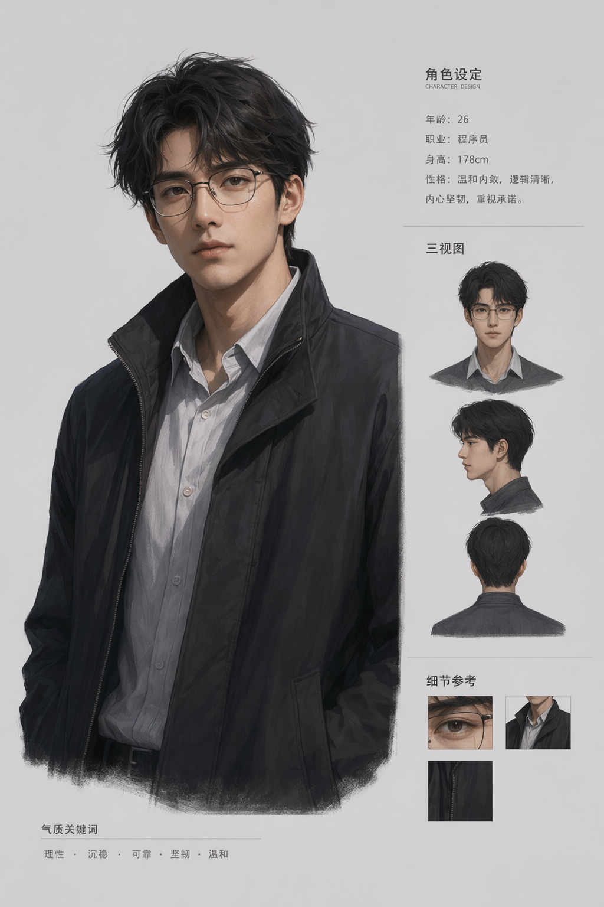

### Demo B: 现代女主设定

---

**Prompt:**
```
请生成一张现代都市女性角色设定图。
设定：25 岁，独立、敏锐，带一点设计师或编辑气质，穿简洁浅色风衣，神情沉静但有主见。
画面要求：半身角色设定图，背景简单，适合后续做人物转化参考。
风格：高质量角色设定图，偏真实游戏角色概念设计，不要像时尚杂志封面。
```

**生成方式:** `generations` API

**生成结果:**

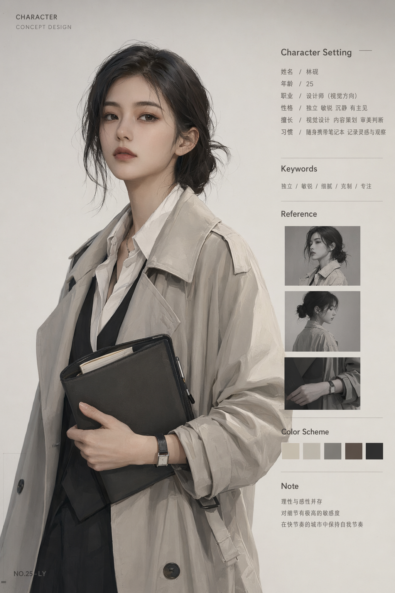

### Demo B+: 穿越契机分镜（9 格剧情图）

在男主、女主的现代设定确立之后、正式进入修仙世界之前，先用 `edits` API 把两人的现代照片同时作为参考图，生成一张 **3x3 九格分镜剧情图**，描述这对情侣**通过什么契机、在什么场合**被卷入修仙世界。

- 同一段剧情，会生成 **两个完全不同的版本**，方便后续游戏开场 CG 做 A/B 选型
- 每一格上方都带有**简短中文小标题**，方便美术 / 策划快速看懂叙事节奏
- **重要剧情设定**：穿越成功后，男主和女主是**分别**降临在修仙世界，并且**互相都不知道**对方也来了 —— 这是后续两条主角线（男主线 / 女主线）"独立成长 → 偶然相遇 → 相互确认"叙事的起点
- 使用 `image[]` 同时传入男主 + 女主参考图，保证两人面部一致
- 输出仍交给底层部署的 `gpt-image` 模型（本 workshop 部署即 gpt-image-2 系列）

---

**Prompt:**
```
请基于参考图中这对现代男女的脸部与气质（务必保持两人长相一致），
生成一张 3x3 共 9 格分镜的剧情漫画图，描述他们「穿越进修仙世界」的契机。

【版本一：午夜古籍书店奇遇 → 分别坠入异界】
1. 左上「雨夜书店」：深夜下雨的二手古籍书店门口，男女主撑同一把伞走进店里，气氛温馨。
2. 中上「无名古书」：男主在书架深处抽出一本无名古书，女主凑过来好奇地看，书脊浮现淡淡金色符文。
3. 右上「符文觉醒」：两人一起翻开书页，金色符文从纸面飞起，环绕在他们头顶，店内灯光开始闪烁。
4. 左中「法阵浮现」：脚下浮现古朴法阵，男主下意识把女主护在身后，女主紧抓男主衣袖，两人都意识到不对劲。
5. 正中「白光撕裂」：刺目的白光从法阵爆开，画面中心是一个巨大的旋转光涡，两人的剪影正在被分别拽向光涡的两侧，伸手却抓不到对方。
6. 右中「分别坠落」：两人各自被一道光柱卷走，画面用斜对角分割：左上半是男主下坠、右下半是女主下坠，背景完全不同，强调"被强行分开"。
7. 左下「男主醒来」：男主独自醒在一处深山古道旁，身上还穿着现代衬衫，周围是陌生的山林雾气，远处有一座道观，他茫然四顾，画面中只有他一人。
8. 中下「女主醒来」：女主独自醒在一座废弃山神庙的破败神像下，身上还穿着现代风衣，窗外有挑灵草担子的修士经过，画面中只有她一人。
9. 右下「各自启程」：左半画面是男主沿着山路独自走向道观方向，右半画面是女主独自走出山神庙融入集市人流，两人完全不在同一场景，谁也不知道对方也来到了这个世界。

【画面要求】
- 严格按照 3 行 x 3 列 = 9 格布局，格与格之间用细黑边框分隔。
- 每一格的正上方都有一条黑底白字的中文小标题条，文字内容严格使用上面对应的 9 个标题（「雨夜书店」「无名古书」「符文觉醒」「法阵浮现」「白光撕裂」「分别坠落」「男主醒来」「女主醒来」「各自启程」），不要写错别字，不要写英文。
- 在第 6 格之后，男女主必须出现在不同的画面里，绝对不要再让他们同框，强调他们在修仙世界里互相不知道对方也穿越了。
- 画风：偏写实的国风漫画 / 游戏 CG 概念图风格，不要 Q 版、不要日系少女漫。
- 两人面部、发型、年龄感必须与参考图保持一致。
- 整体偏冷青色调，渲染"现代 → 修仙世界"的命运被改写感。
```

**生成方式:** `edits` API | **参考图:** `outputs/01_modern_origins_and_xianxia_identities/modern_male_20260503_074109.png` + `outputs/01_modern_origins_and_xianxia_identities/modern_female_20260503_074109.png`


**生成结果（版本一：午夜古籍书店奇遇）:**

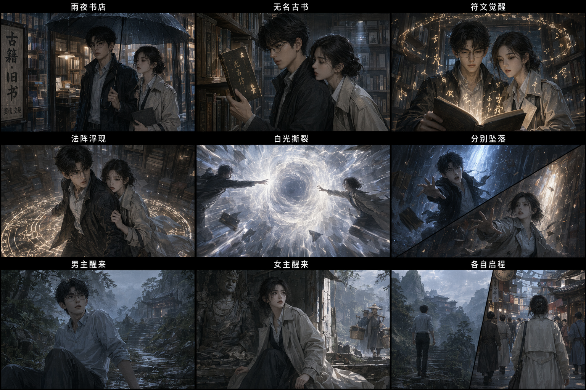

---

**Prompt:**
```
请基于参考图中这对现代男女的脸部与气质（务必保持两人长相一致），
生成一张 3x3 共 9 格分镜的剧情漫画图，描述他们「穿越进修仙世界」的另一种契机。

【版本二：暴雨高架车祸 → 分别醒在异界】
1. 左上「都市晚归」：暴雨夜的城市高架，男主开车，女主坐在副驾，仪表盘亮着柔和的光，两人在低声交谈。
2. 中上「金色裂缝」：前方车道上空，凭空出现一道刺目的金色裂缝，雨水绕开裂缝飞散，两人神情震惊。
3. 右上「失控打滑」：男主猛打方向盘，车辆在湿滑路面失控横甩，车灯光柱直直射向那道金色裂缝。
4. 左中「铜镜虚影」：金色裂缝瞬间扩散成一面巨大的古代铜镜虚影，镜面映出修仙世界的山河，整辆车正被吸向镜面。
5. 正中「白光吞噬」：白光从铜镜中爆开，吞没整辆车，画面中心是巨大的光涡，男主和女主在副驾与主驾的位置上被安全带紧束，伸手却抓不到对方。
6. 右中「裂为两道」：光涡在中央裂成左右两道光柱，男主被左侧光柱拽走、女主被右侧光柱拽走，明显是被命运强行分开，背景已经看不到对方。
7. 左下「男主醒于荒山」：男主独自醒在一处荒山古道旁，身上是撕裂的现代衬衫，身边只有一只破损的车门残片，远处有御剑而过的修士剪影，画面中只有他一人。
8. 中下「女主醒于山庙」：女主独自醒在一座破败山神庙中，身上是凌乱的现代风衣，神像缝隙间漏下的光打在她脸上，窗外有挑着灵草担子的村民经过，画面中只有她一人。
9. 右下「各自上路」：左半画面是男主独自踉跄着走向远处的修士村落，右半画面是女主独自走出山神庙顺着山道下山，两人完全不在同一画面，谁也不知道对方也活着、也来到了这个世界。

【画面要求】
- 严格按照 3 行 x 3 列 = 9 格布局，格与格之间用细黑边框分隔。
- 每一格的正上方都有一条黑底白字的中文小标题条，文字内容严格使用上面对应的 9 个标题（「都市晚归」「金色裂缝」「失控打滑」「铜镜虚影」「白光吞噬」「裂为两道」「男主醒于荒山」「女主醒于山庙」「各自上路」），不要写错别字，不要写英文。
- 在第 6 格之后，男女主必须出现在不同的画面里，绝对不要再让他们同框，强调他们在修仙世界里互相不知道对方也穿越了。
- 画风：偏写实的国风漫画 / 游戏 CG 概念图风格，不要 Q 版、不要日系少女漫。
- 两人面部、发型、年龄感必须与参考图保持一致。
- 整体偏暗调暖色 + 金色灵光，渲染命运被强行改写的氛围。
```

**生成方式:** `edits` API | **参考图:** `outputs/01_modern_origins_and_xianxia_identities/modern_male_20260503_074109.png` + `outputs/01_modern_origins_and_xianxia_identities/modern_female_20260503_074109.png`


**生成结果（版本二：暴雨高架车祸）:**

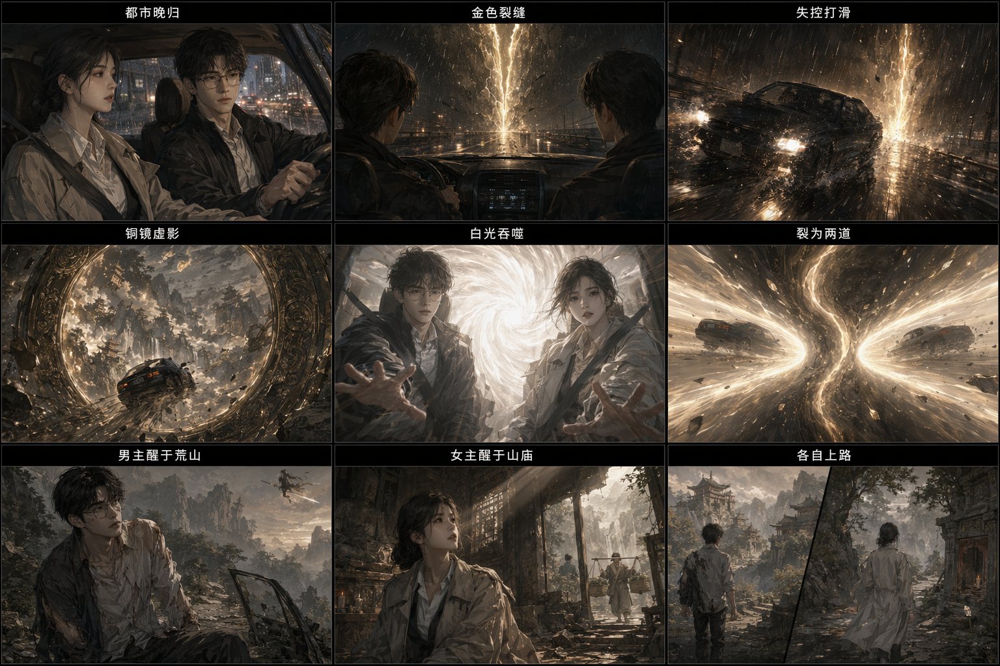

### Demo C: 男主穿越后的炼气期外门弟子形象

---

**Prompt:**
```
基于这位现代男性的脸部气质与年龄感，把他改成修仙世界中的外门弟子。
设定：刚穿越不久，出身寒微，仍在炼气期，衣着朴素但神采清明。
重要：穿越后不再戴眼镜（视力已被灵气修复），请去掉眼镜。
保留他温和但坚韧的气质，不要变成霸道男主脸。
服装为低阶宗门弟子服，颜色低调，带一点旧布料和简易佩剑。
构图：全身站立，略带警惕地打量新世界，与现代版的半身构图形成对比。
背景简洁，像角色设定图。
```

**生成方式:** `edits` API | **参考图:** `outputs/01_modern_origins_and_xianxia_identities/modern_male_20260503_074109.png`


**生成结果:**

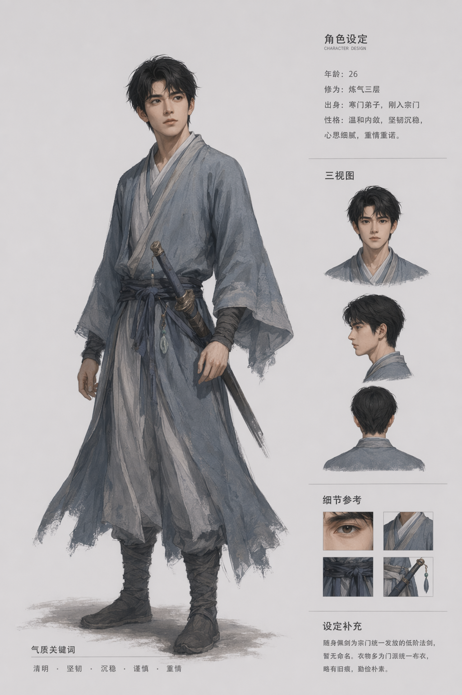

### Demo D: 女主穿越后的炼气期散修形象

---

**Prompt:**
```
基于这位现代女性的脸部气质与年龄感，把她改成修仙世界中的低阶散修「沈听雪」。
设定：刚穿越不久，仍在炼气期，独自摸索生存之道，衣着轻便，眼神沉静但戒备。
保留她敏锐、克制、有主见的气质，不要变成柔弱仙女。
服装简洁，带少量符纸、药囊和旧法器碎片。
角色名「沈听雪」，请在设定卡上显示这个名字。
构图：全身站立，单手按住腰间的药囊，动态感比现代版更强。
背景简洁，像角色设定图。
```

**生成方式:** `edits` API | **参考图:** `outputs/01_modern_origins_and_xianxia_identities/modern_female_20260503_074109.png`


**生成结果:**

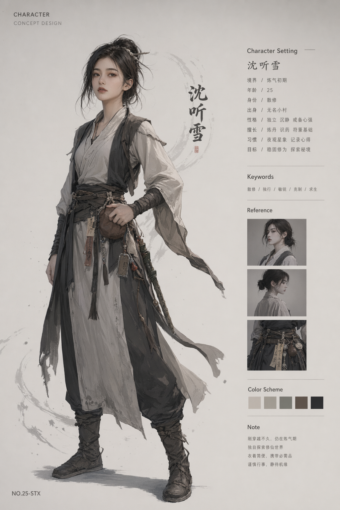


## 第二章 · 男主成长弧线

本章聚焦于角色一致性与成长弧线的实操。许多同学在用 GPT-Image-2 进行角色设计时，最关心的就是：**“模型生成的角色，能否在多张图里保持一致？还能不能让角色自然地‘成长’？”**

下面以男主为例，完整演示从外门弟子的炼气期、筑基、金丹，再到战斗状态立绘的全过程。每一张图都是基于上一阶段的结果做 edits，大家可以直观看到角色的核心五官和气质如何始终保持一致，同时又能通过 prompt 明确表达阶段变化和身份成长。

如果你只想记住一条经验，那就是：**“保持核心五官和气质不变 + 明确说出阶段变化和身份变化”——这两句话写进 prompt，就是角色成长的钥匙。**

这一章将用连续 edits，带你体验男主从炼气期底层到金丹后期的成长全过程。

### Demo A: 男主从炼气进入筑基

---

**Prompt:**
```
保持这名男修的脸部气质和核心识别度不变（注意：他不戴眼镜）。
让他成长到筑基期初成，气质更沉稳，法衣更整洁。
身份变化：已从外门弟子升为内门弟子，佩剑升级为中品灵剑，腰牌换为内门令牌。
构图变化：改为正面半身特写，双手负于身后，展现自信但内敛的气质。
不是高高在上的大修士，而是刚刚脱离底层、开始被宗门重视的年轻修士。
背景保持角色设定图风格。
```

**生成方式:** `edits` API | 参考图:** `01:xianxia_male_qi_entry`


**

**生成结果:**

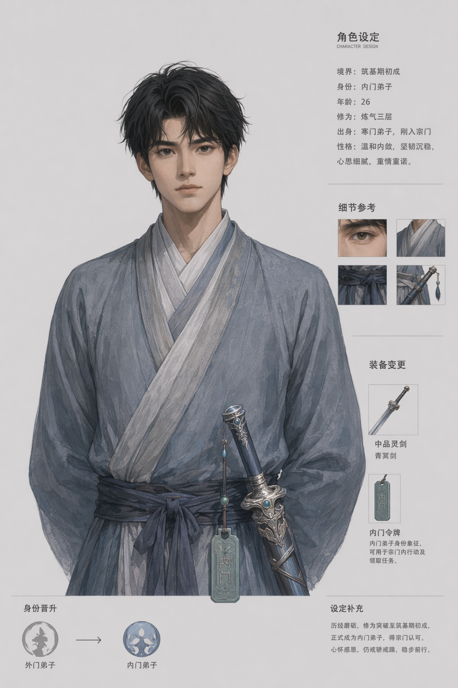

### Demo B: 男主成长到金丹期

---

**Prompt:**
```
保持这名男修的核心五官与整体识别度不变（不戴眼镜）。
让他成长到金丹期后期，整体气质更自信更沉稳，法衣材质更高级，有明显灵力纹路。
身份变化：已是宗门核心弟子，佩剑为上品灵剑「碎星」，腰间有金丹令符。
构图变化：改为全身动态姿势——单手握剑鞘，微微侧身回望，衣袂被灵风轻拂，展现"久经历练"的从容。
让角色有"已经历练多年"的感觉，但不要变成中年人。
依然保持东方修仙世界的审美，不要西式奇幻铠甲。
```

**生成方式:** `edits` API | **参考图:** `outputs/02_male_protagonist_growth_arc/male_foundation_stage_20260503_075311.png`


**生成结果:**

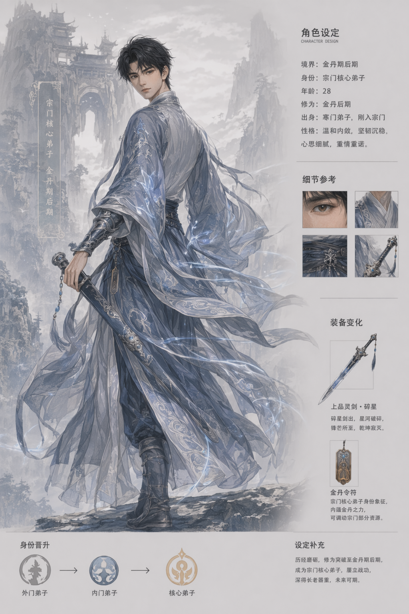

### Demo C: 男主战斗状态立绘

---

**Prompt:**
```
保持这名男修的脸部与法衣识别度不变（不戴眼镜）。
把他改成金丹后期战斗状态动态立绘。
构图变化：改为低视角仰拍全身，腾空姿态，灵力环绕全身，长剑「碎星」出鞘悬于身侧，衣摆和发丝被灵风猛烈掀起。
画面要有强烈的战斗张力和速度感，但仍是角色立绘，不是复杂场景海报。
表情从温和变为凌厉专注。
```

**生成方式:** `edits` API | **参考图:** `outputs/02_male_protagonist_growth_arc/male_core_stage_20260503_075311.png`


**生成结果:**

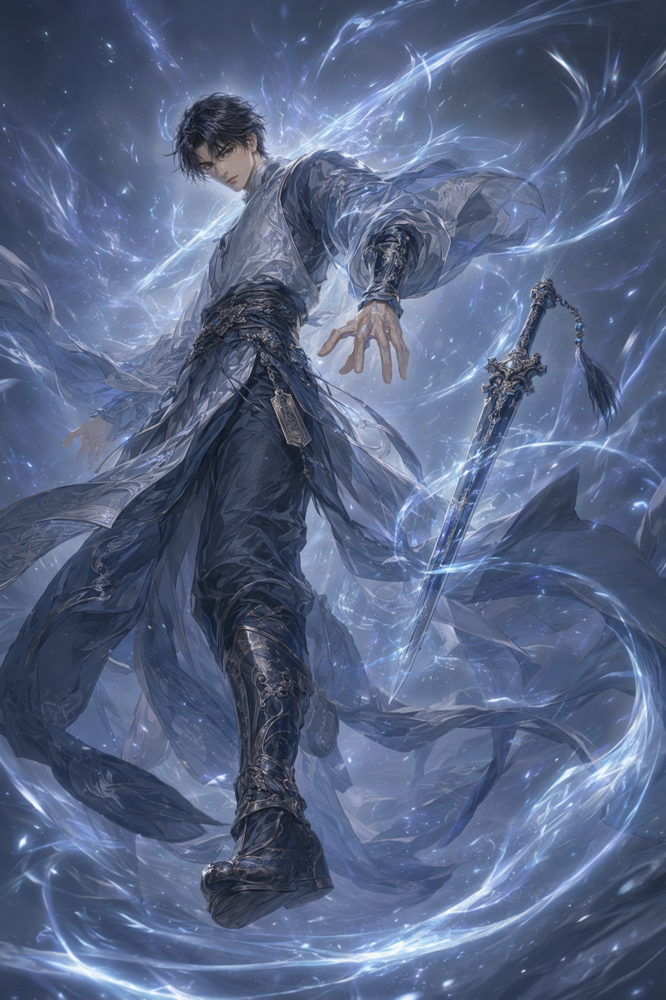


## 第三章 · 女主成长弧线

> 男主线设计完了，接下来切换到双线叙事中的另一位主角：女主「沈听雪」。这一章会把同样的方法在女主身上**再跑一遍**，完整演示她从炼气期散修成长到金丹后期战斗状态的过程。
>
> 这一章主要有两个目的：
>
> 1. 看到同一套 **“成长弧 prompt 模板”** 是**可以复用**的，不是只适用于男主；
> 2. 看到 **女性角色 + 法术系战斗风格** 的细节该如何处理，例如飘逸的法衣、符箓飞旋、储物袋、阵盘、丹药和施法姿态，这些都会形成和男主剑修路线完全不同的视觉语言。
>
> 这条线完成之后，我们就同时拥有**两条独立的角色成长资产库**，可以分别支撑双主角叙事中的不同玩家剧情线。

### Demo A: 女主从炼气散修成长到筑基

---

**Prompt:**
```
保持这名女修「沈听雪」的脸部气质、年龄感和核心识别度不变。
让她成长到筑基期，气质更沉着自信，服装从破旧散修变为整洁利落的独行修士。
身份变化：已掌握制符之术，随身高阶符箓增多，有了中品储物袋和自制丹药。
构图变化：改为正面半身，双手交叉抱臂，眼神直视前方，展现"我靠自己走到这里"的底气。
她不是宗门圣女，而是一路靠自己走出来的年轻女修。
角色名「沈听雪」请在设定卡上显示。
画面保持角色设定图风格。
```

**生成方式:** `edits` API | 参考图:** `01:xianxia_female_qi_entry`


**

**生成结果:**

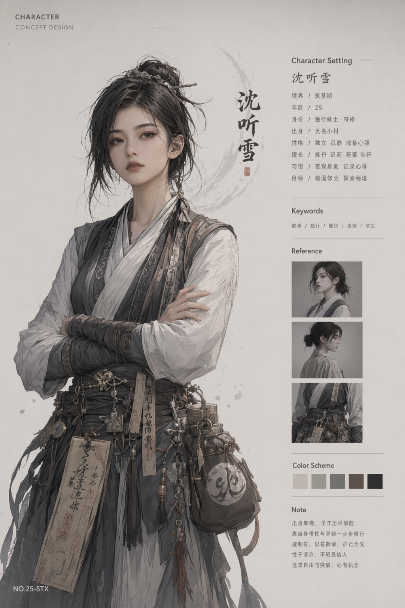

### Demo B: 女主成长到金丹期

---

**Prompt:**
```
保持这名女修「沈听雪」的核心五官与整体识别度不变。
让她成长到金丹后期，气场更强，法衣更轻灵飘逸但材质更高级，身上符箓法器更精致。
身份变化：已是闻名一方的制符散修，佩戴本命符箓「玉清真符」，拥有高阶阵盘和多种丹药。
构图变化：改为全身侧身回望，一手轻抚腰间符箓册，衣袂在微风中轻扬，展现从容自若的气度。
她的气质是冷静、敏锐、极有主见，而不是高冷模板脸。
角色名「沈听雪」请在设定卡上显示。
依然保持东方修仙审美，不要西式魔法师造型。
```

**生成方式:** `edits` API | **参考图:** `outputs/03_female_protagonist_growth_arc/female_foundation_stage_20260503_080212.png`


**生成结果:**

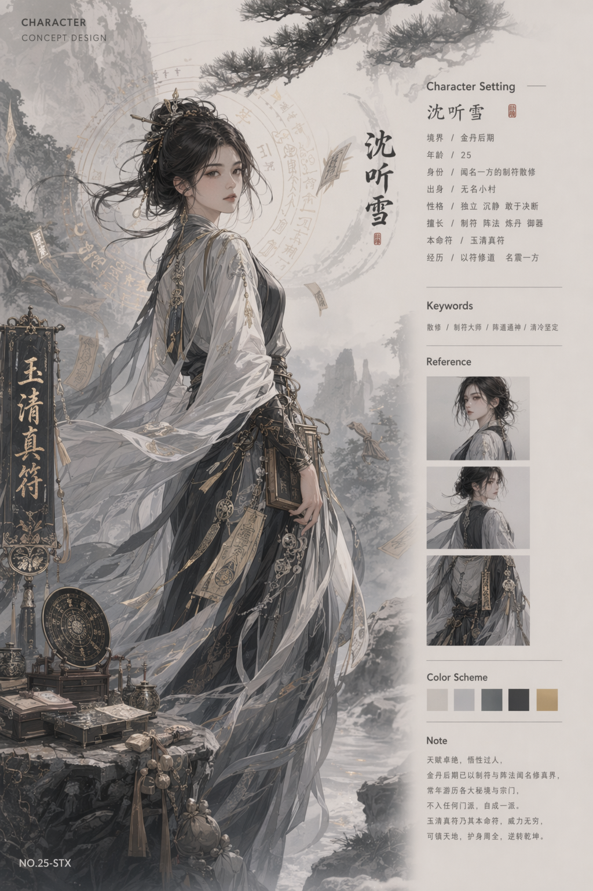

### Demo C: 女主法术战斗状态立绘

---

**Prompt:**
```
保持这名女修「沈听雪」的脸部与法衣识别度不变。
把她改成金丹后期施法状态动态立绘。
构图变化：改为俯视角全身动态——她悬浮于半空，双手展开操控数十张飞旋的符箓，形成符阵。灵光在符纸间流转，衣摆与散落的长发被灵力气旋猛烈吹起。
表情从平静变为专注凌厉，展现施法时的强大压迫感。
画面要有法术张力和视觉冲击，但仍是角色立绘，不是复杂海报场景。
```

**生成方式:** `edits` API | **参考图:** `outputs/03_female_protagonist_growth_arc/female_core_stage_20260503_080212.png`


**生成结果:**

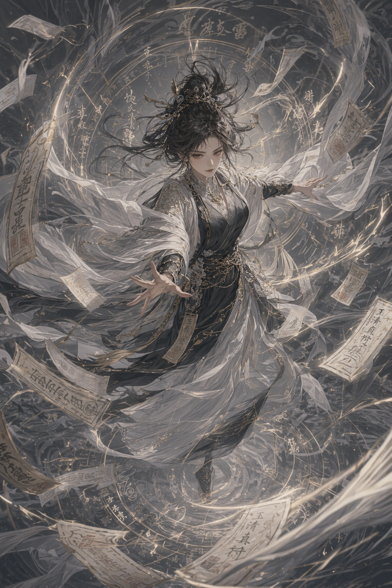


## 第四章 · 世界观：宗门、坊市与试炼

>
> 到现在为止，男女主从凡人到金丹的两条主线已经立起来了。但游戏不能只有角色——**修仙游戏的灵魂一半在人，一半在世界。**
>
> 所以这一章我们暂时把镜头从人身上挪开，去把**世界观**先撑出来：
>
> - 男主出身的宗门山门长什么样？
> - 女主早期讨生活的修仙坊市又是什么气质？
> - 通往金丹的那个"必经的秘境试炼"，画面是什么感觉？
>
> 这些场景图后续会被你们的关卡策划、场景原画、3D 场景建模拿去当**统一氛围参考**，所以这一步看似在"画背景"，其实是在**给整个项目定调**。

---

这一章补足世界观。人物之外，修仙 workshop 还需要门派、城市、秘境、试炼场景。

### Demo A: 男主所在宗门的外门山门

---

**Prompt:**
```
请生成一张东方修仙世界的宗门外门山门场景概念图。
设定：这是一座中型宗门的外门入口，山道蜿蜒，古石牌楼与云雾中的低阶弟子练习场相连。
画面要有“从底层起步”的感觉，不是仙宫圣地。
风格：高质量游戏场景概念图，适合 worldbuilding 说明。
```

**生成方式:** `generations` API

**生成结果:**

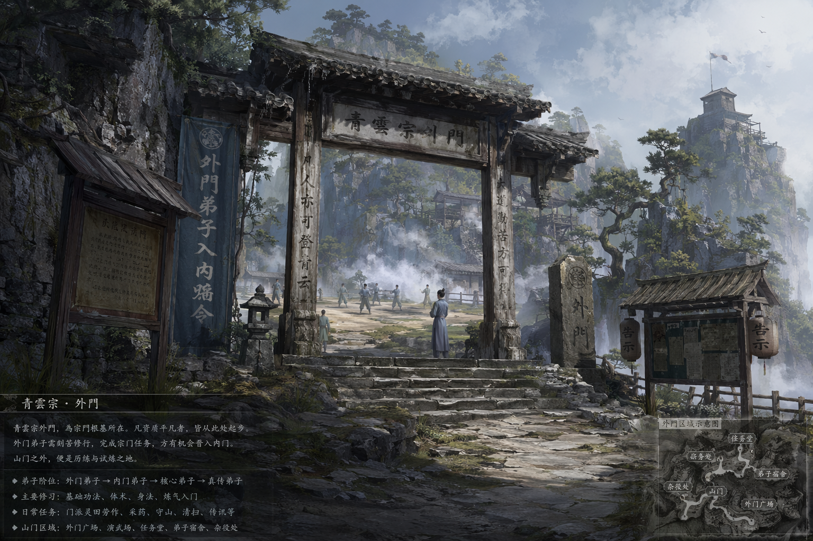

#### gpt-image-2 自由发挥，给宗门起名 “青云宗”

### Demo B: 女主早期生存的修仙坊市

---

**Prompt:**
```
请生成一张修仙世界早期坊市场景概念图。
设定：低阶散修与行脚商人聚集的山间坊市，木棚、符箓摊、灵草摊、旧法器摊并存。
画面要体现底层修士谋生的真实感，而不是华丽仙都。
风格：高质量游戏场景概念图。
```

**生成方式:** `generations` API

**生成结果:**

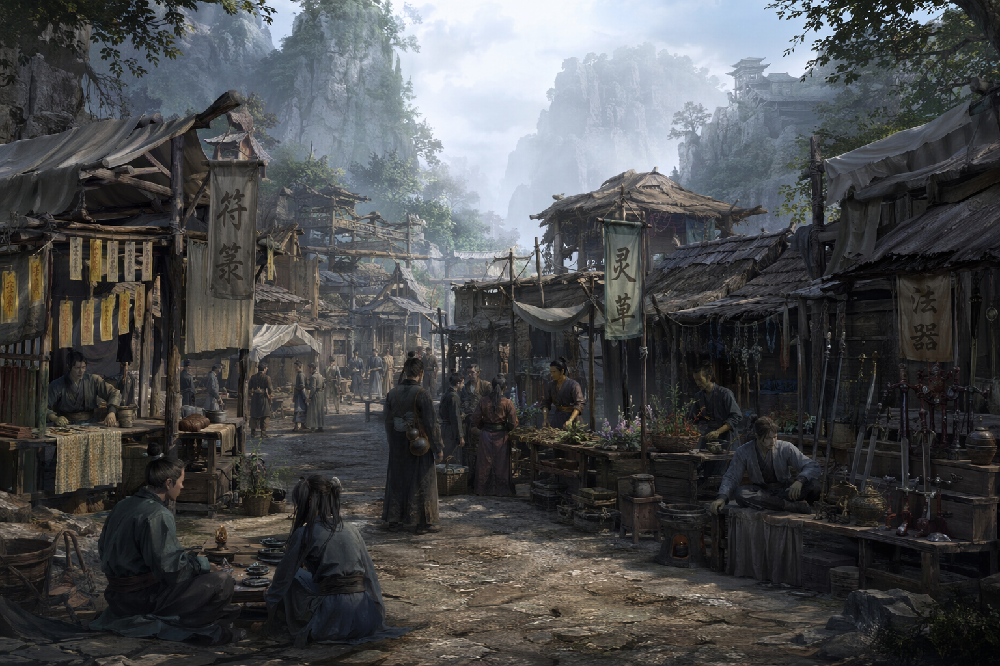

### Demo C: 两人各自经历的秘境试炼

---

**Prompt:**
```
请生成一张修仙秘境试炼场景概念图。
设定：断裂石桥、悬空古台、灵气风暴、远处巨大的古代阵法残骸，给人“金丹前必须闯过的大试炼”感觉。
风格：高质量游戏副本场景概念图，具有强烈叙事感和层次感。
```

**生成方式:** `generations` API

**生成结果:**

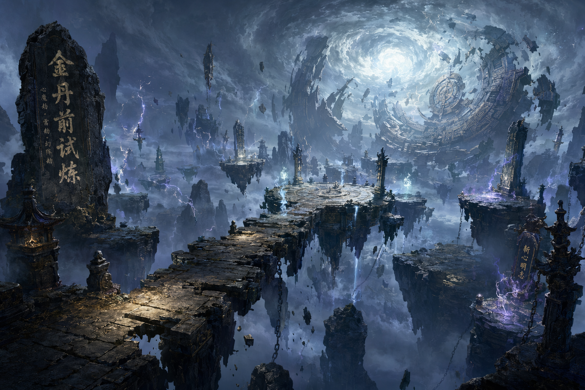


## 第五章 · 元婴重逢与携手破境

---

好，到这里我们已经有了：男主线、女主线、世界观场景三套资产。下面就要进入整条故事线的情绪高潮：

- 男女主分别突破到元婴
- 在同一世界中终于认出彼此
- 携手一起突破更高境界

### Demo A: 男主突破到元婴

---

**Prompt:**
```
保持这名男修「林景深」的核心五官与识别度不变（不戴眼镜）。
让他突破到元婴初期，法衣更加高阶华贵，灵力更沉稳内敛，整个人有"多年生死历练后终于踏入更高境界"的感觉。
身份变化：已离开青云宗独自游历，是名震一方的剑修，佩剑为极品灵剑「碎星」已通灵。
构图变化：改为全身坐姿——盘膝悬浮于山巅云海之上，灵剑横于膝前，周身有淡金色元婴灵光隐现。神情平静深邃，有历尽沧桑后的通透。
不是老祖形象，依然是年轻但成熟的修士。
```

**生成方式:** `edits` API | 参考图:** `02:male_battle_portrait`


**

**生成结果:**

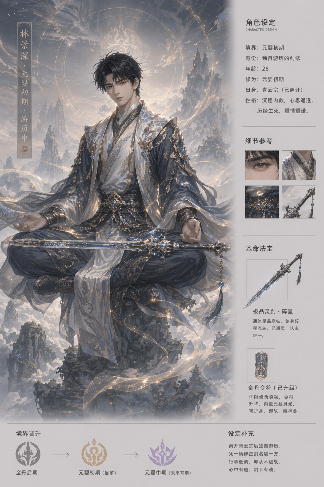

### Demo B: 女主突破到元婴

---

**Prompt:**
```
保持这名女修「沈听雪」的核心五官与识别度不变。
让她突破到元婴初期，法衣更高阶飘逸，气质更从容强大，有"独自一路杀出重围"的成熟感。
身份变化：已是修真界知名的制符大师，本命法器「玉清真符」已成法宝，随身阵盘可瞬间布下大阵。
构图变化：改为全身站立于高处——一手负于身后，一手轻捻一枚悬浮的玉符，衣袂在云风中大幅飘扬。俯瞰天下的气度。
依然年轻，但更从容、更强大。
角色名「沈听雪」请显示。
```

**生成方式:** `edits` API | 参考图:** `03:female_battle_portrait`


**

**生成结果:**

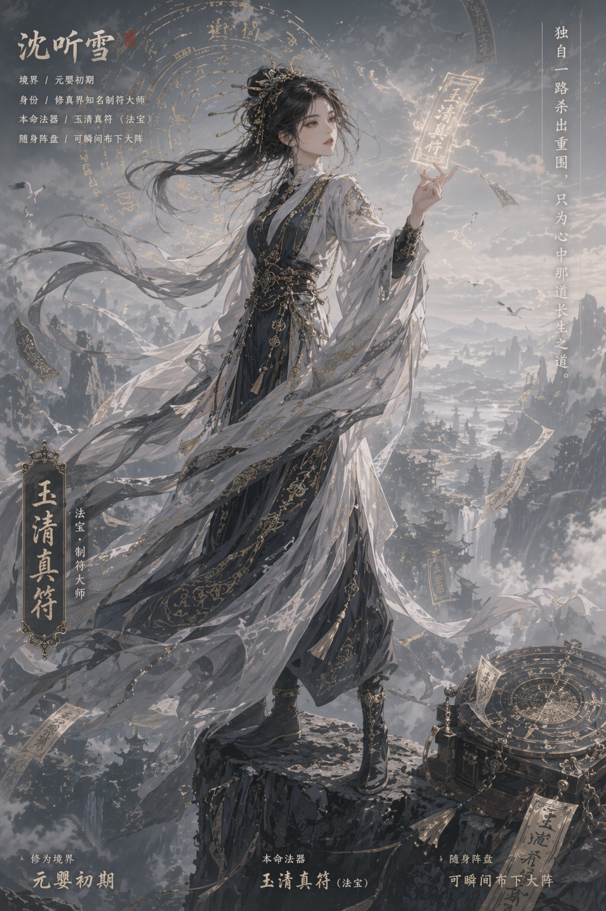

### Demo C: 元婴期重逢

---

**Prompt:**
```
使用这两位修士作为参考，生成一张他们在元婴期终于认出彼此的重逢场景。
场景：暮色中的断崖边，远处有坍塌的古代传送阵残骸，天边最后一缕霞光映在云海上。
核心情感：两人相对而立，距离两步之遥。男修（林景深）停下脚步，灵剑从手中滑落，表情从震惊变为颤抖的确认。女修（沈听雪）单手捂住嘴，眼中含泪但嘴角不自觉上扬。
不是含蓄的"互相打量"，而是认出对方那一刻的情感爆发——克制了多年的思念在这一刻决堤。
画面风格：高质量游戏剧情关键帧，电影级光影，情感张力最大化。
```

**生成方式:** `edits` API | 参考图: male_yuanying+female_yuanying


**生成结果:**

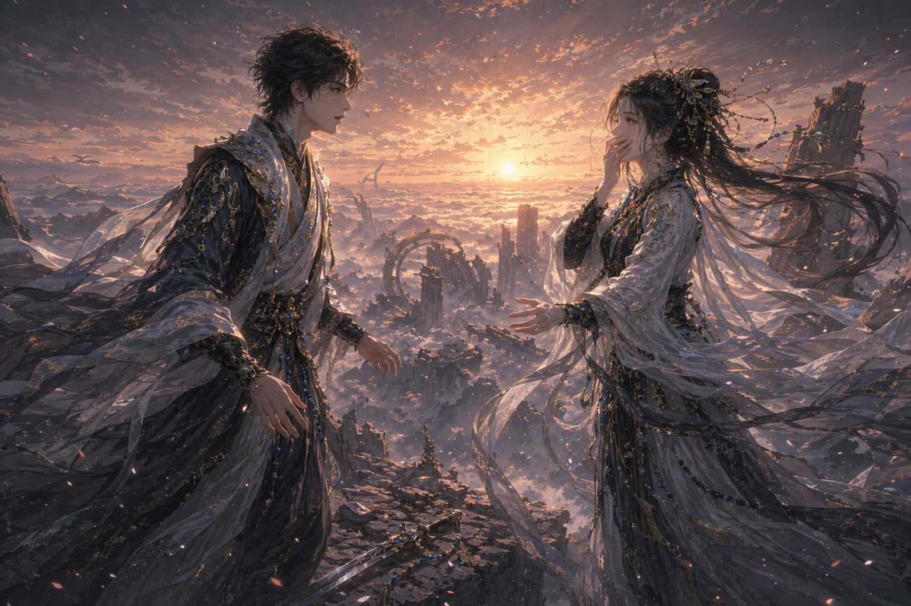

### Demo D: 携手突破更高境界

---

**Prompt:**
```
基于这张重逢场景，把画面升级成两人携手冲击更高境界的英雄主视觉。
构图：两人并肩悬浮于古代天阵中央，面朝同一方向（镜头），背对背微微倾斜。
林景深灵剑在右手高举，沈听雪左手展开数十符箓环绕二人。两人的灵力在空中交汇融合，形成一个巨大的双色灵力漩涡（蓝+金）。
表情：二人都是坚定而从容的微笑，有"道侣并肩，无所畏惧"的气魄。
画面要有史诗级修仙海报感，适合做游戏章节主视觉。
```

**生成方式:** `edits` API | 参考图: reunion_scene


**生成结果:**

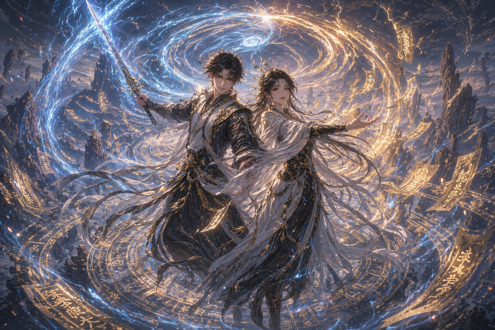


## 第六章 · 营销主视觉与叙事海报


>
> 到第五章为止，我们已经做完了"叙事产物"。但游戏团队真正要**对外讲故事、对外卖产品**的时候，需要的是另一类资产——**营销 KV、海报、icon 套装**。
>
> 这一章我们就把刚才那张元婴重逢的 hero image 当原料，演示三件事：
>
> 1. 怎么改成**横版 banner**，并且**预留标题安全区**；
> 2. 怎么改成**手机端竖版海报**；
>
> 最后我还会加一个 bonus：**剪影宇宙叙事海报**，给男主和女主各做一张可以做收藏版周边的高审美海报。

---

### Demo A: 横版营销 KV，预留标题区

---

**生成方式:** `edits` API | **参考图:** `outputs/05_yuanying_reunion_and_joint_breakthrough/joint_breakthrough_hero_20260503_081121.png`


**生成结果:**

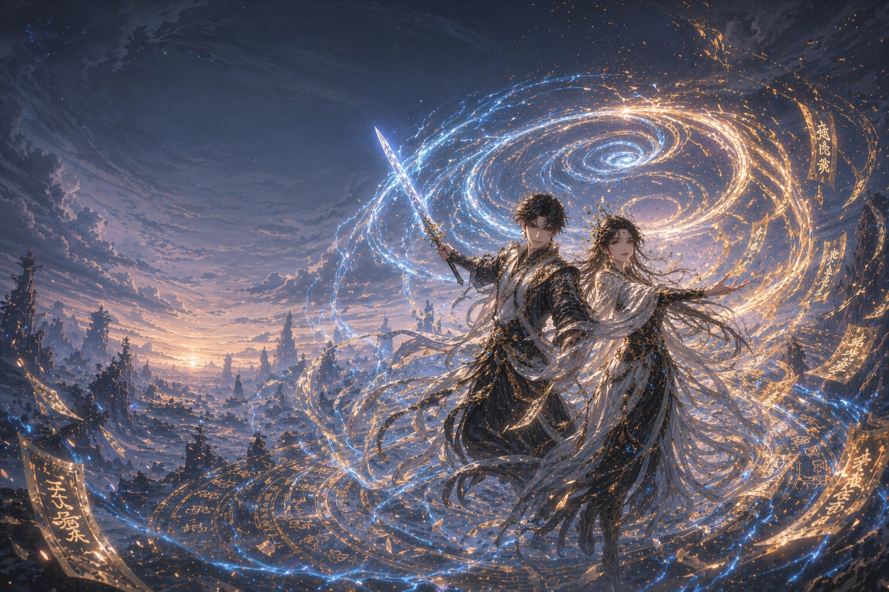

### Demo B: 竖版海报

---

**生成方式:** `edits` API | **参考图:** `outputs/05_yuanying_reunion_and_joint_breakthrough/joint_breakthrough_hero_20260503_081121.png`


**生成结果:**

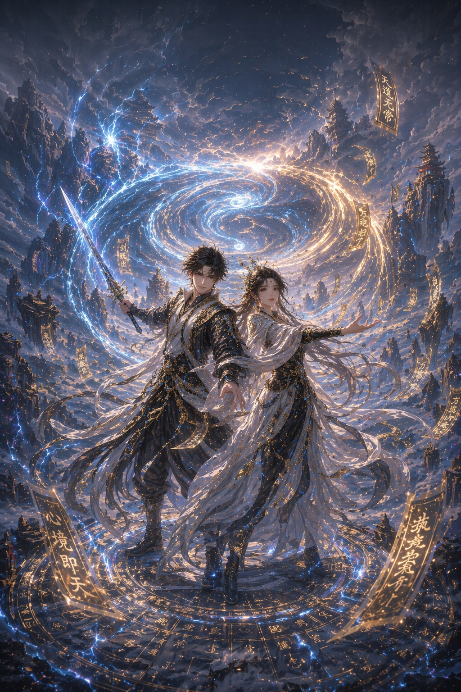

### Demo B+: 竖版海报色调优化 — 从“土豪金”到“天道清冷”

原始竖版海报金色元素过于密集（金色漩涡、金色粒子、金色法阵、金色符文铺满画面），
视觉上互相抢注意力，缺乏层次感。以下是两轮 iterative refinement 的过程：

#### 优化思路

| 轮次 | 方向 | 核心改动 |
|------|------|----------|
| V2 (冷色调) | 全面去金，换冰蓝 | 去掉80%金色粒子，漩涡→银蓝，法阵→青蓝 |
| V3 (平衡版) | 冷底+精准暖光 | 保持银蓝基调，人物加金色轮廓光做焦点，法阵中心加白金核心 |

**关键洞察**: 全冷色虽然干净，但缺少视觉锚点。少量精准的暖色点缀（人物轮廓光）
反而能让冷色调更有层次，同时避免原版“金色大爆炸”的廉价感。

#### V2: 全面冷色调

**Prompt:**
```
Redesign this xianxia poster keeping same two characters and composition.
Replace most golden/amber energy effects with cool silver-white and ice-blue tones:
- Swirling energy vortex: change from gold to silver-blue/platinum
- Floating particles: sparse silver-white motes instead of dense gold sparks
- Ground formation circle: cool blue/cyan instead of gold
- Rune/text elements: pale blue glow instead of amber
- Keep characters unchanged, retain minimal gold accents on costume embroidery only
- Overall color temperature: shift from warm gold to cool silver-blue "heavenly dao" aesthetic
- Background: deeper navy/indigo for contrast
```

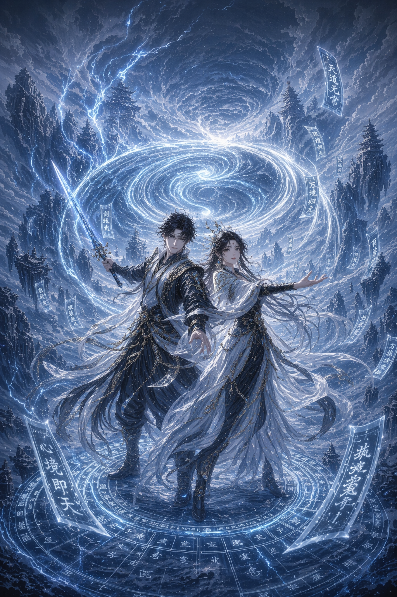

#### V3: 冷底 + 暖光平衡 ✅ (最终版)

V2 太冷了，缺少视觉焦点。这次的方向：冷底 + 少量精准暖光点缀 = 高级感。

**Prompt:**
```
Refine this xianxia couple breakthrough poster with a premium color balance:
- Overall palette: deep navy/indigo background with silver-blue energy as the dominant tone
- Character rim light: add a warm golden outline/rim light around both characters as visual focal point
- Formation circle: keep blue/cyan but add a small white-gold core light at center
- Floating elements: sparse silver-white motes, NO dense gold particles
- Runes: pale blue glow
- Key principle: 85% cool tones + 15% precise warm accents = premium immortal cultivation feel
- The warm gold should only appear as: character rim light + formation center core
```

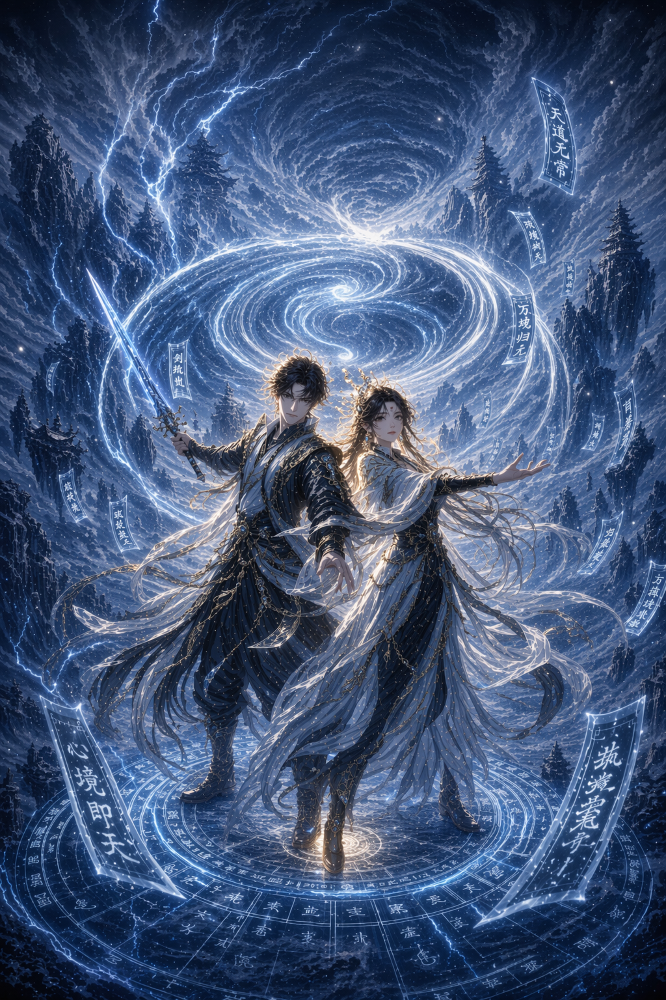

#### 对比总结

| 版本 | 色温 | 金色占比 | 视觉焦点 | 整体感觉 |
|------|------|----------|----------|----------|
| 原版 | 暖金 | ~60% | 分散 | 土豪金、闪亮但廉价 |
| V2 | 全冷 | ~5% | 缺失 | 干净但缺少灵魂 |
| V3 ✅ | 冷底+暖点缀 | ~15% | 人物轮廓 | 高级、天道感、有焦点 |

**结论**: 图像优化不是简单的“减少XX元素”，而是重新分配视觉权重。
V3 通过将金色从“铺满全图”收缩到“仅在人物轮廓”，
实现了既保留仙侠氛围又提升高级感的效果。

---

### 元婴重逢图像去鳞片化优化

在使用 GPT-Image-2 做连续 `edit image` 的时候，有一个很常见的小问题：如果一张图被反复编辑多轮，模型有时会把上一轮里已经存在的纹理、颗粒、边缘细节继续放大，导致画面噪点变多、局部变“脏”，甚至在衣料、云气、山石或能量特效上出现类似**鳞片化**的高频纹理。

下面这张元婴重逢图就是一个典型例子。主体构图和情绪都已经比较到位，但局部纹理偏碎，画面不够干净。因此这里额外演示一组“只做清理、不改构图”的优化 prompt，用来把画面重新拉回更平滑、更干净的插画质感。

**优化前原图:**


#### 1. English Clean Illustration Prompt

**Prompt:**
```text
clean illustration, smooth shading.soft lighting,controlled details,minimal texture, high clarity,refined edges,smooth gradients. Avoid noise, grain, artifacts, high frequency detail, dirty texture,oversharpen, blotchy, chaotic details
```

**生成结果:**

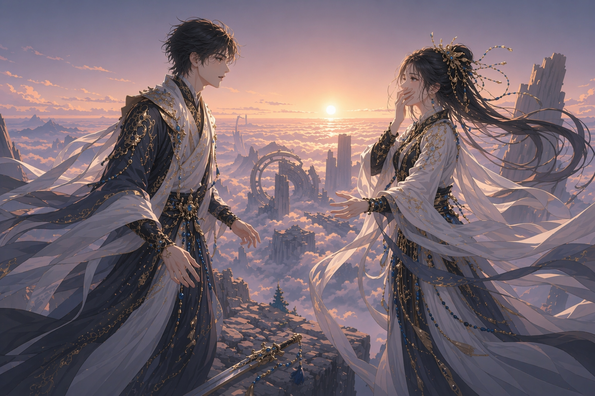

#### 2. English Remove Noise Prompt

**Prompt:**
```text
Remove the noise and high-frequency details from the image. Keep all the lines, colors,and brightness unchanged.
```

**生成结果:**

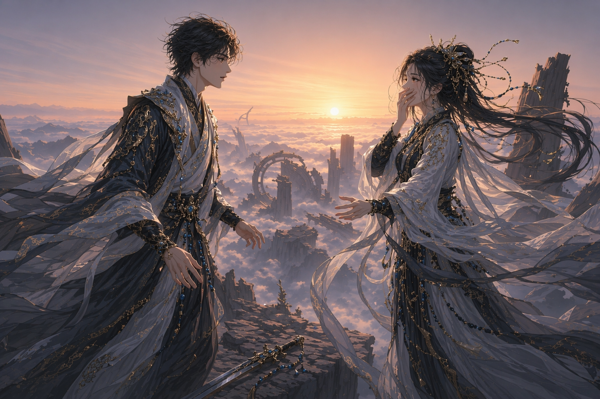

#### 3. Chinese Clean Illustration Prompt

**Prompt:**
```text
干净的插画，平滑的明暗过渡，柔和光照，细节可控，最少纹理，高清晰度，精细边缘，平滑渐变。避免噪点、颗粒、伪影、高频细节、脏污纹理、过度锐化、斑驳和混乱细节。
```

**生成结果:**

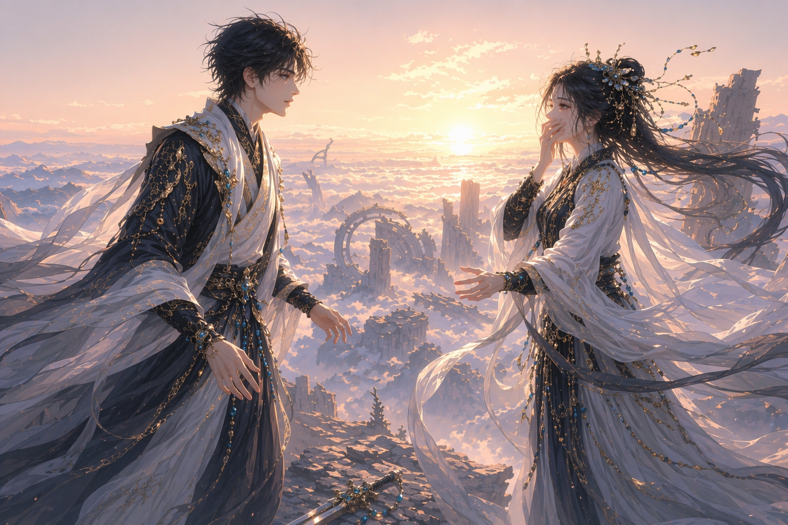

#### 4. Chinese Remove Noise Prompt

**Prompt:**
```text
去除图像中的噪点和高频细节。保持所有线条、颜色和亮度不变。
```

**生成结果:**

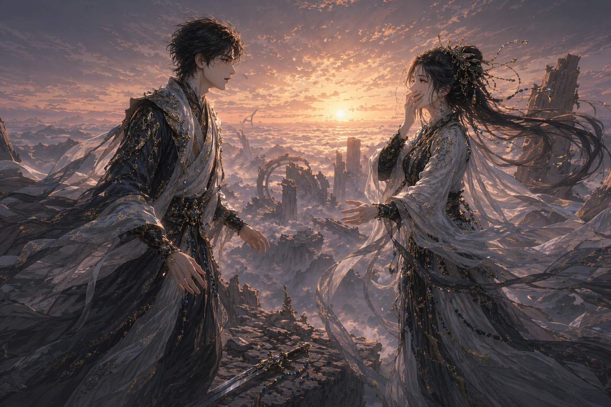

---


### 新增: Silhouette Universe 叙事海报

使用 [Silhouette Universe Narrative Poster](https://github.com/ZeroLu/awesome-gpt-image#silhouette-universe-narrative-poster) 提示词模板，结合角色参考图生成高品质收藏级叙事海报。

#### 设计理念

"剪影宇宙"不是简单把世界放进一个容器里，而是让整个主题宇宙**自然生长**在剪影轮廓的内外之间。最终效果应像一张高端收藏版电影海报，融合：
- 水彩质感与纸质印刷感
- 大气透视与体积光
- 负空间与克制布局
- 叙事深度与情感张力

#### 男主 — 剑修求道之路

**参考图:** `outputs/02_male_protagonist_growth_arc/male_battle_portrait_20260503_075311.png`


**Prompt:**
```
Automatically generate a high-aesthetic "Silhouette Universe / Collector's Edition Narrative Poster" based on [theme: 仙侠剑修的孤独求道之路 - 一位青年剑修从凡人修炼到渡劫飞升的史诗旅程，融入剑、山巅、雷劫、灵气旋涡、古老剑冢等意象]. Do not default to common containers such as bottles, hourglasses, glass domes, or pocket watches. Instead, let the AI choose the most symbolic, visually strong, and narratively suitable outer silhouette for the theme. The silhouette can be an artifact, building, gate, tower, archway, dome, stairwell, corridor, statue, profile, eye, hand, skull, wing, mask, mirror, throne, ring, crack, light curtain, shadow, geometric form, spatial cross-section, stage frame, abstract symbol, or any more creative contour that best represents the theme.

The goal is not to simply place a world inside an object, but to make the entire themed universe grow naturally within, around, and through the silhouette itself. The silhouette should be elegant, recognizable, and compositionally dominant. Inside or along its boundary, generate a rich and layered narrative world strongly tied to the theme, including iconic scenes, key architecture or spaces, symbols and metaphors, traces of characters or civilizations, foreground-midground-background depth, and atmosphere with emotional tension.

The final composition should feel like a premium collector's poster with strong design value. The large shapes should feel stable, the main silhouette should be unmistakable, and the inner world should have depth, structure, and breathing room. Details should be rich but not crowded.

Blend the feeling of a collector's edition film poster, high-end narrative visual design, dreamy watercolor texture, and fine printed paper. Emphasize paper grain, feathered edges, watercolor brush marks, gentle diffusion, atmospheric perspective, soft haze, selective volumetric light, light passing through mist, generous negative space, and restrained layout. The image should feel premium, poetic, majestic, sacred, nostalgic, quiet, and mythic.

Color palette: dark copper and aged paper tones with hints of cold steel blue, reminiscent of ancient sword cultivator scrolls. Avoid chaotic high saturation, cheap neon effects, or plastic digital color.

基于提供的参考角色形象，在海报中融入该角色的剪影或意象元素，使其成为叙事世界的一部分。角色为一位青年剑修，冷峻坚毅，佩长剑，白衣墨发。海报应以竖版9:16比例呈现。
```

**中文翻译:**
```
基于 [主题：仙侠剑修的孤独求道之路 - 一位青年剑修从凡人修炼到渡劫飞升的史诗旅程，融入剑、山巅、雷劫、灵气旋涡、古老剑冢等意象]，自动生成一张高审美的“剪影宇宙 / 收藏版叙事海报”。不要默认使用瓶子、沙漏、玻璃罩、怀表等常见容器。让 AI 根据主题自行选择最具象征性、视觉冲击力最强、叙事最贴切的外部剪影。剪影可以是法器、建筑、门、塔、拱门、穹顶、阶梯井、走廊、雕像、侧脸、眼睛、手、头骨、羽翼、面具、镜子、王座、戒指、裂缝、光幕、阴影、几何形、空间剖面、舞台框架、抽象符号，或任何更有创意、最能代表主题的轮廓。

目标不是简单地把一个世界放进某个物体里，而是让整个主题宇宙在剪影本身的内部、周围和边界之间自然生长。剪影应当优雅、清晰可识别，并在构图中占据主导地位。在剪影内部或边界附近，生成一个与主题强相关、层次丰富的叙事世界，包括标志性场景、关键建筑或空间、象征与隐喻、角色或文明留下的痕迹、前中后景深度，以及带有情绪张力的氛围。

最终画面应呈现高级收藏海报的质感，并具备强烈的设计价值。大形稳定，主剪影必须清晰明确，内部世界要有深度、结构和呼吸感。细节可以丰富，但不要拥挤。

融合收藏版电影海报、高端叙事视觉设计、梦幻水彩质感和精致纸张印刷感。强调纸张颗粒、羽化边缘、水彩笔触、柔和扩散、大气透视、轻雾、选择性的体积光、光穿过雾气的感觉、充足的负空间，以及克制的布局。画面应显得高级、诗意、宏大、神圣、怀旧、安静且具有神话感。

色彩方案：深铜色与旧纸色为主，点缀冷钢蓝，联想到古老剑修卷轴。避免混乱的高饱和、廉价霓虹效果或塑料感数字色彩。

基于提供的参考角色形象，在海报中融入该角色的剪影或意象元素，使其成为叙事世界的一部分。角色为一位青年剑修，冷峻坚毅，佩长剑，白衣墨发。海报应以竖版 9:16 比例呈现。
```

**生成方式:** `edits` API + 参考图 | **尺寸:** 1024×1536 | **质量:** high

**结果:**

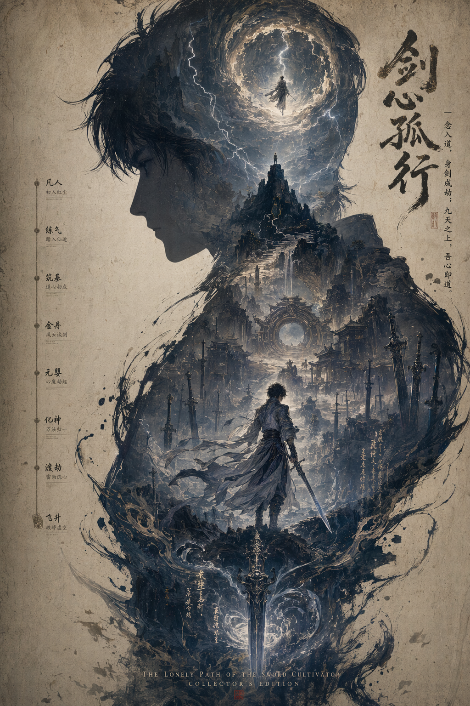

#### 女主 — 符箓仙子飞天之梦

**参考图:** `outputs/03_female_protagonist_growth_arc/female_battle_portrait_20260503_080212.png`


**Prompt:**
```
Automatically generate a high-aesthetic "Silhouette Universe / Collector's Edition Narrative Poster" based on [theme: 仙侠符箓仙子的飞天之梦 - 一位灵秀女修从入门到化神的蜕变之旅，融入符箓、莲花、飞天绸带、法阵、灵泉、凤凰涅槃等意象]. Do not default to common containers such as bottles, hourglasses, glass domes, or pocket watches. Instead, let the AI choose the most symbolic, visually strong, and narratively suitable outer silhouette for the theme. The silhouette can be an artifact, building, gate, tower, archway, dome, stairwell, corridor, statue, profile, eye, hand, skull, wing, mask, mirror, throne, ring, crack, light curtain, shadow, geometric form, spatial cross-section, stage frame, abstract symbol, or any more creative contour that best represents the theme.

The goal is not to simply place a world inside an object, but to make the entire themed universe grow naturally within, around, and through the silhouette itself. The silhouette should be elegant, recognizable, and compositionally dominant. Inside or along its boundary, generate a rich and layered narrative world strongly tied to the theme, including iconic scenes, key architecture or spaces, symbols and metaphors, traces of characters or civilizations, foreground-midground-background depth, and atmosphere with emotional tension.

The final composition should feel like a premium collector's poster with strong design value. The large shapes should feel stable, the main silhouette should be unmistakable, and the inner world should have depth, structure, and breathing room. Details should be rich but not crowded.

Blend the feeling of a collector's edition film poster, high-end narrative visual design, dreamy watercolor texture, and fine printed paper. Emphasize paper grain, feathered edges, watercolor brush marks, gentle diffusion, atmospheric perspective, soft haze, selective volumetric light, light passing through mist, generous negative space, and restrained layout. The image should feel premium, poetic, majestic, sacred, nostalgic, quiet, and mythic.

Color palette: twilight purple and mist white-gray with touches of gold, evoking the ethereal beauty of celestial maidens. Avoid chaotic high saturation, cheap neon effects, or plastic digital color.

基于提供的参考角色形象，在海报中融入该角色的剪影或意象元素，使其成为叙事世界的一部分。角色为一位仙侠女修，温婉灵秀，善符箓法术，紫衣飘逸。海报应以竖版9:16比例呈现。
```

**中文翻译:**
```
基于 [主题：仙侠符箓仙子的飞天之梦 - 一位灵秀女修从入门到化神的蜕变之旅，融入符箓、莲花、飞天绸带、法阵、灵泉、凤凰涅槃等意象]，自动生成一张高审美的“剪影宇宙 / 收藏版叙事海报”。不要默认使用瓶子、沙漏、玻璃罩、怀表等常见容器。让 AI 根据主题自行选择最具象征性、视觉冲击力最强、叙事最贴切的外部剪影。剪影可以是法器、建筑、门、塔、拱门、穹顶、阶梯井、走廊、雕像、侧脸、眼睛、手、头骨、羽翼、面具、镜子、王座、戒指、裂缝、光幕、阴影、几何形、空间剖面、舞台框架、抽象符号，或任何更有创意、最能代表主题的轮廓。

目标不是简单地把一个世界放进某个物体里，而是让整个主题宇宙在剪影本身的内部、周围和边界之间自然生长。剪影应当优雅、清晰可识别，并在构图中占据主导地位。在剪影内部或边界附近，生成一个与主题强相关、层次丰富的叙事世界，包括标志性场景、关键建筑或空间、象征与隐喻、角色或文明留下的痕迹、前中后景深度，以及带有情绪张力的氛围。

最终画面应呈现高级收藏海报的质感，并具备强烈的设计价值。大形稳定，主剪影必须清晰明确，内部世界要有深度、结构和呼吸感。细节可以丰富，但不要拥挤。

融合收藏版电影海报、高端叙事视觉设计、梦幻水彩质感和精致纸张印刷感。强调纸张颗粒、羽化边缘、水彩笔触、柔和扩散、大气透视、轻雾、选择性的体积光、光穿过雾气的感觉、充足的负空间，以及克制的布局。画面应显得高级、诗意、宏大、神圣、怀旧、安静且具有神话感。

色彩方案：暮紫色与雾白灰为主，点缀金色，唤起天界仙子的空灵美感。避免混乱的高饱和、廉价霓虹效果或塑料感数字色彩。

基于提供的参考角色形象，在海报中融入该角色的剪影或意象元素，使其成为叙事世界的一部分。角色为一位仙侠女修，温婉灵秀，善符箓法术，紫衣飘逸。海报应以竖版 9:16 比例呈现。
```

**生成方式:** `edits` API + 参考图 | **尺寸:** 1024×1536 | **质量:** high

**结果:**

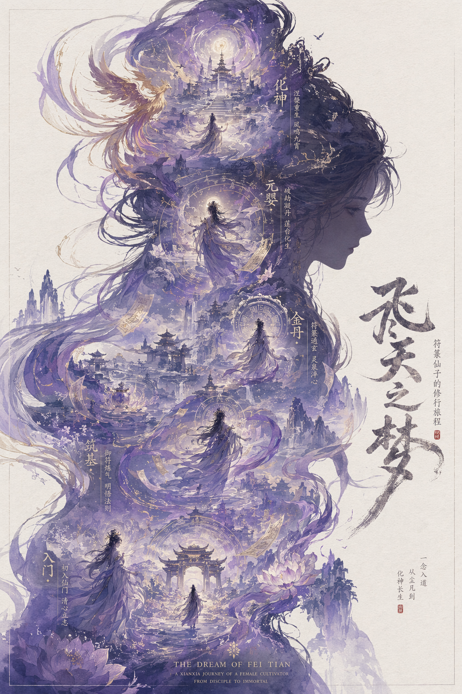


## 第七章 · 3D 生产流水线全套参考

>
> 我们会沿着真实的 3D 预生产流水线，把以下几类参考图全部用 GPT-Image-2 跑一遍：
>
> - **角色三视图**（建模师起手就要的）
> - **服装材质 / 服装分层拆解 / 光照参考球**（贴图、材质、灯光师要的）
> - **武器道具正交视图 + 尺寸标注**（道具建模要的）
> - **表情板 + 多角度表情**（绑定师、Blendshape 要的）
> - **战斗 / 飞行 / 施法 / 防御动作关键帧**（动画师 blocking 要的）
> - **场景概念 + 完整带 UI 的游戏截图**（场景、UI、关卡策划要的）
>

---

本章展示一条完整的 3D 预生产流程：从角色三视图、服装材质、武器道具，到表情绑定、动作关键帧、场景概念和游戏界面截图。

### 展示结构

| 阶段 | 内容 | 3D 价值 |
|------|------|----------|
| 1 | 角色基础与三视图 | 建模比例、轮廓、服装结构 |
| 2 | 材质、服装与光照 | 贴图、材质、渲染参考 |
| 3 | 武器与道具 | 道具建模、尺寸、材质拆解 |
| 4 | 表情与面部绑定 | Blendshape、表情范围、角度参考 |
| 5 | 动作与动画关键帧 | Blocking、重心、动作线、技能表现 |
| 6 | 场景与游戏界面 | 关卡白盒、战斗 UI、成品截图概念 |

---

### 交付重点

- 按 3D 生产流程组织素材，便于建模、贴图、绑定、动画和关卡团队分别查阅
- 每个 demo 保留 Prompt、参考图、生成方式和结果图，方便复现与后续复用
- 涉及角色一致性的素材优先展示 `edits API + 参考图` 结果

---

# 1. 角色基础与三视图

先确定男女主的三视图结构，为后续建模、服装拆解、动作设计提供统一角色基线。

### 1.1 男主三视图 (Character Turnaround Sheet)

三视图是 3D 建模的第一步。生成前/侧/背三个角度，统一线稿风格，方便建模师直接参考。

**Prompt:**
```
Based on this character, create a professional 3D modeling turnaround reference sheet.
Show the SAME character from 3 angles: front view, 3/4 side view, and back view.
- Consistent A-pose or relaxed standing pose across all views
- Clean neutral grey background with subtle gradient
- Clear silhouette with all costume details visible
- Include annotation arrows pointing to key design elements
- Label key parts: headpiece, collar, belt, boots, accessories
- Professional concept art style, semi-realistic rendering
- Consistent proportions and features across all 3 views
```

**中文翻译:**
```
基于这个角色，创建一张专业的 3D 建模三视图参考表。
展示同一个角色的三个角度：正面、3/4 侧面、背面。
- 所有视图保持一致的 A-pose 或自然放松站姿
- 使用干净的中性灰背景，并带有轻微渐变
- 角色轮廓清晰，所有服装细节都应可见
- 添加标注箭头，指向关键设计元素
- 标注关键部位：头饰、领口、腰带、靴子、配饰
- 专业概念设计风格，半写实渲染
- 三个视图中的比例与五官特征保持一致
```

**生成方式:** `edits` API | **参考图:** `outputs/02_male_protagonist_growth_arc/male_battle_portrait_20260503_075311.png`


**生成结果:**

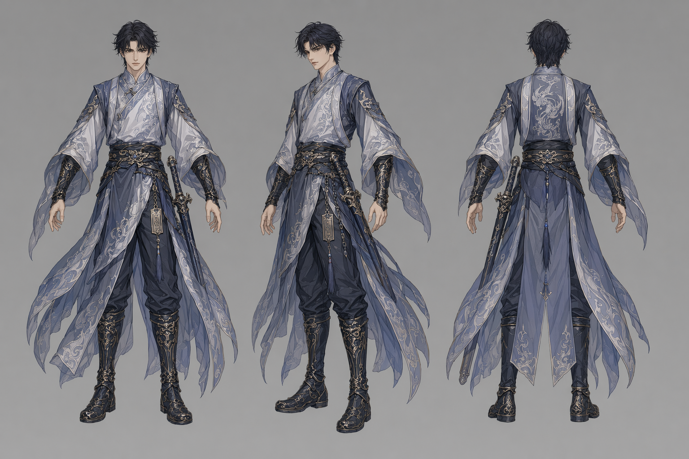

### 1.2 女主三视图 (Character Turnaround Sheet)

**Prompt:**
```
Based on this character, create a professional 3D modeling turnaround reference sheet.
Show the SAME character from 3 angles: front view, 3/4 side view, and back view.
- Consistent A-pose or relaxed standing pose across all views
- Clean neutral grey background with subtle gradient
- Clear silhouette with flowing robes and ribbons visible
- Include annotation arrows pointing to key design elements
- Label key parts: hair ornaments, ribbons, layered robes, spiritual artifacts
- Professional concept art style, semi-realistic rendering
- Consistent proportions and features across all 3 views
```

**中文翻译:**
```
基于这个角色，创建一张专业的 3D 建模三视图参考表。
展示同一个角色的三个角度：正面、3/4 侧面、背面。
- 所有视图保持一致的 A-pose 或自然放松站姿
- 使用干净的中性灰背景，并带有轻微渐变
- 角色轮廓清晰，能看出飘逸长袍和丝带结构
- 添加标注箭头，指向关键设计元素
- 标注关键部位：发饰、丝带、分层长袍、灵性法器
- 专业概念设计风格，半写实渲染
- 三个视图中的比例与五官特征保持一致
```

**生成方式:** `edits` API | **参考图:** `outputs/03_female_protagonist_growth_arc/female_battle_portrait_20260503_080212.png`


**生成结果:**

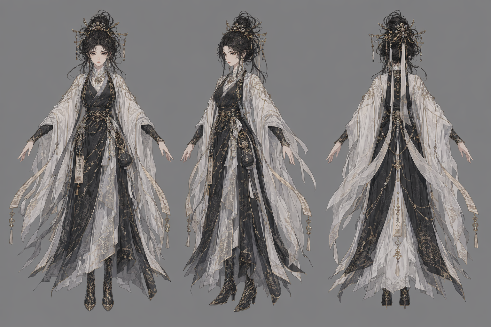

---

# 2. 材质、服装与光照参考

这一组素材面向贴图师、材质师和灯光师，帮助拆解角色服装层次、PBR 材质语言和不同环境光照效果。

---

### 2.1 服装材质特写 (Costume & Material Close-ups)

为贴图师提供材质细节参考：布料纹理、金属光泽、刺绣细节等。

**Prompt:**
```
基于这个角色的服装设计，创建一个材质/纹理参考板。
展示服装中6种不同材质的特写样本：
- 主袍丝绸 — 展示织纹和光泽感
- 金属配饰 — 腰扣、发冠、剑坠，展示氧化质感
- 刺绣细节 — 云纹/龙纹/灵纹图案，线织纹理
- 皮革部件 — 靴子、腰带，展示皮纹和缝线
- 轻纱内衬 — 展示透光层次和飘逸感
- 玉石材质 — 玉佩、发簪宝石，次表面散射效果
每个样本标注中文材质名称。专业PBR材质参考风格，统一打光。
```

**生成方式:** `edits` API | **参考图:** `outputs/02_male_protagonist_growth_arc/male_battle_portrait_20260503_075311.png`


**生成结果:**

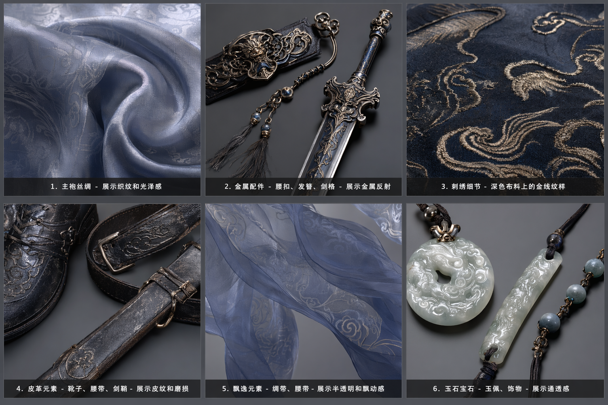

---

### 2.2 男主服装分层拆解

分层展示角色穿着层次，帮助建模师理解 UV 分割和穿着逻辑。

**Prompt:**
```
基于这个男性仙侠角色，创建一张服装分层拆解参考图。
展示方式：从左到右，逐层穿戴：
【第1层】内衬：贴身白色中衣，展示剪裁和收口方式
【第2层】中衣：深色长袍，展示开襟方向和腰线位置
【第3层】外袍：华丽主袍，展示肩部结构和下摆长度
【第4层】配饰层：腰带+玉佩+剑穗+发冠（单独排列）
【第5层】完整穿戴效果（正面全身）
每层标注：名称、缝合/接口位置、材质说明、配色方案色卡。
风格：平面技术图解风格，白色背景，线条清晰。
适合3D建模师理解穿着层次和UV分割。所有文字简体中文。
```

**参考图:** `outputs/02_male_protagonist_growth_arc/male_battle_portrait_20260503_075311.png`


**生成方式:** `edits` API + 参考图

**生成结果:**

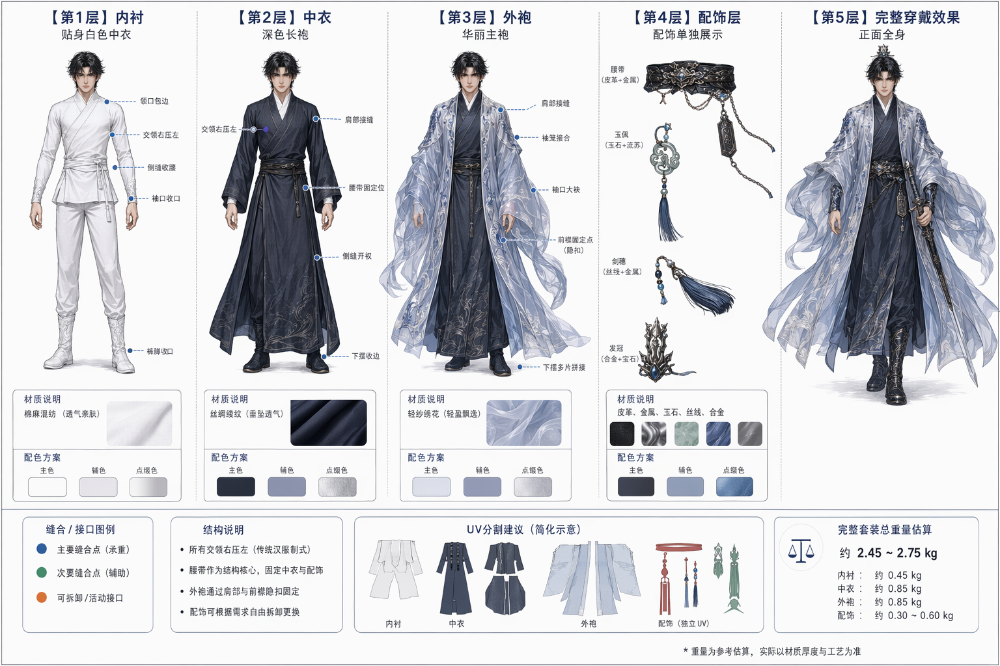

---

### 2.3 女主服装分层拆解

展示女性仙侠服装的分层穿着逻辑，与男主服装拆解形成对照参考。

**Prompt:**
```
基于这个女性仙侠角色，创建一张服装分层拆解参考图。
展示方式：从左到右，逐层穿戴：
【第1层】内衬：贴身白色亵衣，展示剪裁轮廓
【第2层】中裙：素色长裙，展示腰线和裙摆结构
【第3层】外衣：华丽仙女袍，宽袖飘逸，展示肩部披帛和袖口设计
【第4层】配饰层：发簪+耳坠+腰封+玉佩+丝带（单独排列）
【第5层】完整穿戴效果（正面全身）
每层标注：名称、系带位置、材质说明（蚕丝、薄纱、锦缎、玉石等）
配色方案色卡（主色淡紫+辅色银白+点缀翠绿）
风格：平面技术图解风格，白色背景，线条清晰。
适合3D建模师理解女性仙侠服装穿着层次。所有文字简体中文。
```

**参考图:** `outputs/03_female_protagonist_growth_arc/female_battle_portrait_20260503_080212.png`


**生成方式:** `edits` API + 参考图

**生成结果:**

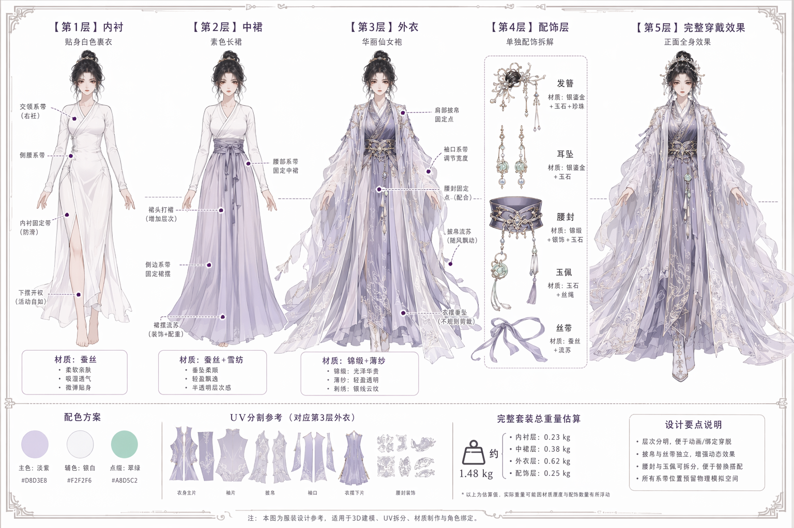

---

### 2.4 男主光照环境参考

展示角色在 6 种不同光照环境下的效果，帮助灯光师快速理解每个场景的设置。

**Prompt:**
```
为仙侠游戏角色创建一张光照参考球展示图。
2行×3列网格布局：
第一行（日常场景）：
1.「晨光」：温暖金色侧光，长投影，雾气氛围
2.「正午」：顶部白光，高对比，短投影
3.「暮色」：橙红逆光，轮廓光强烈，面部半影
第二行（特殊场景）：
4.「仙境」：青蓝色散射光，柔和无明确方向，皮肤微微发光
5.「战斗」：红橙爆炸光+蓝色法术光对比，动态多色光源
6.「夜间」：月光冷色顶光+萤火虫暖色点光源，极低照度
每格展示：半身像 + 金属球和白色球的光照参考。
每格底部标注：光照名称、主光方向、色温、推荐使用场景。
风格：写实CG渲染参考。所有标注简体中文。
```

**参考图:** `outputs/02_male_protagonist_growth_arc/male_battle_portrait_20260503_075311.png`


**生成方式:** `edits` API + 参考图

**生成结果:**

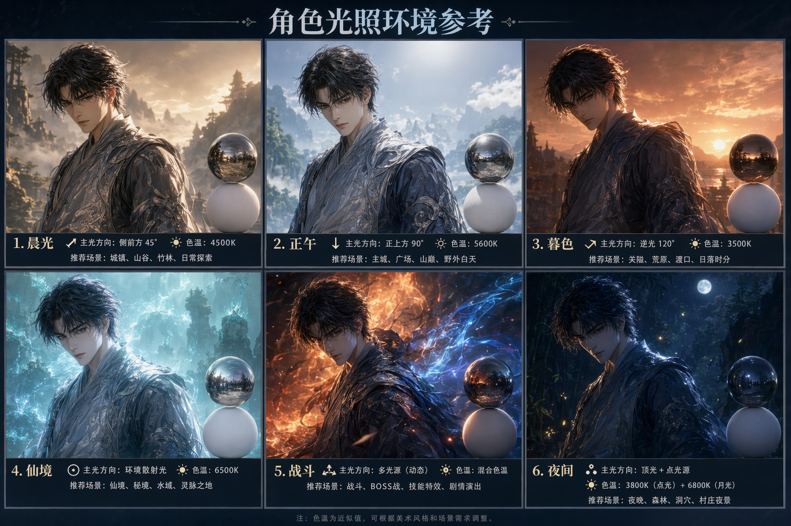

---

### 2.5 女主光照环境参考

展示女主在 6 种不同光照环境下的效果，其中战斗场景使用紫色法术光与金色防护罩光，体现角色差异。

**Prompt:**
```
为仙侠游戏女性角色创建一张光照参考球展示图。
2行×3列网格布局：
第一行（日常场景）：
1.「晨光」：温暖金色侧光，长投影，雾气氛围
2.「正午」：顶部白光，高对比，短投影
3.「暮色」：橙红逆光，轮廓光强烈，发丝光晕
第二行（特殊场景）：
4.「仙境」：青蓝色散射光，柔和无明确方向，皮肤微微发光
5.「战斗」：紫色法术光+金色防护罩光对比，动态多色光源
6.「夜间」：月光冷色顶光+萤火虫暖色点光源，极低照度
每格展示：半身像 + 金属球和白色球的光照参考。
风格：写实CG渲染参考。所有标注简体中文。
```

**参考图:** `outputs/03_female_protagonist_growth_arc/female_battle_portrait_20260503_080212.png`


**生成方式:** `edits` API + 参考图

**生成结果:**

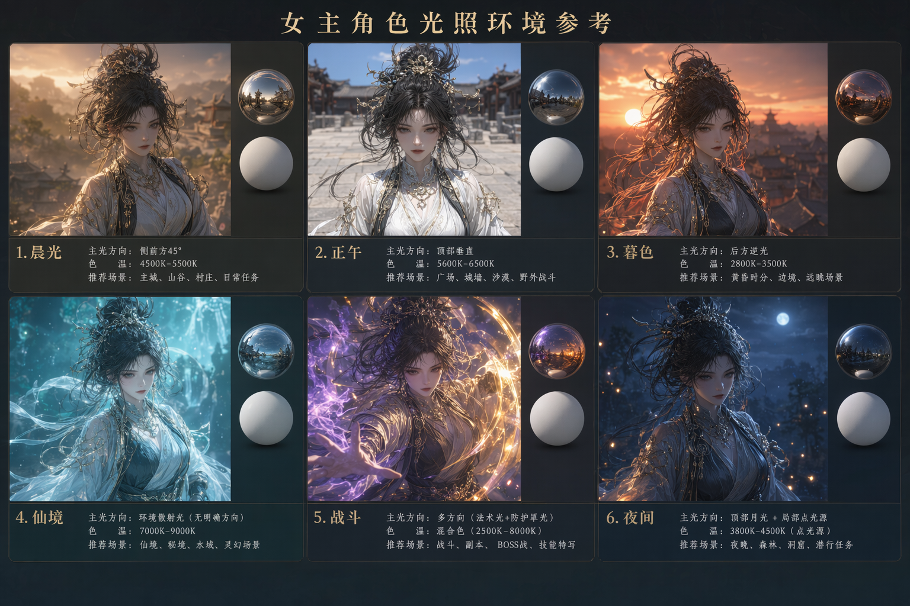

---

# 3. 武器与道具正交参考

这一组素材用于道具建模，重点提供正交视图、尺寸标注、材质说明和局部结构拆解。

---

### 3.1 武器道具正交总览 (Weapon & Prop Orthographic)

武器道具的多角度正交视图，直接用于道具建模。

**Prompt:**
```
创建一个仙侠游戏武器道具正交参考图。
展示以下道具的正面和侧面正交视图：
1. 灵剑 — 玉镶嵌剑身，全长约90厘米，标注剑柄/剑身/剑鞘材质
2. 符箓册 — 古朴灵木封面，内页有发光符文，展示打开和合上两种状态
3. 对玉坠 — 阴阳配对灵器，展示纹路细节和丝绳编织
每件道具标注：中文名称、尺寸（厘米）、材质说明。
包含比例尺（厘米）。干净浅灰背景。专业游戏资产参考风格。
```

**生成方式:** `generations` API

**生成结果:**

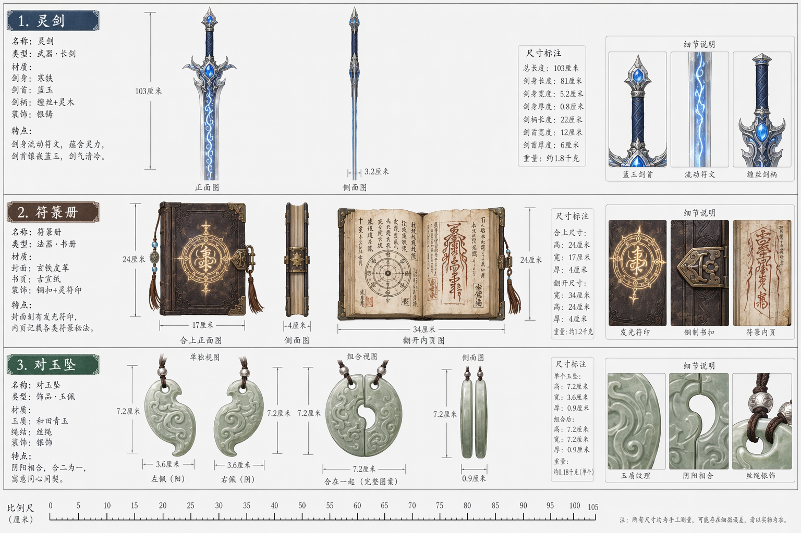

---

### 3.2 天璇法杖正交设计

正交视图 + 尺寸标注 + 材质说明，适合 3D 道具建模。

**Prompt:**
```
为仙侠游戏创建法杖道具正交参考图。
白色背景，展示一根仙侠风格法杖的设计：
【名称】天璇法杖
【正面图】完整法杖正面视图
【侧面图】90度侧面视图
【顶部特写】杖首设计——莲花形底座托举一颗悬浮灵珠
【握柄特写】木纹与金属缠绕纹理细节
【底端特写】杖底的平衡锤设计（莲蓬形）
标注信息（全中文）：
- 总长：152cm
- 杖首直径：12cm
- 握柄直径：3.5cm
- 材质：灵木（主体）、青铜（装饰环）、灵珠（杖首）
- 重量参考：约1.8kg
底部包含厘米比例尺。
风格：干净正交概念设计，适合3D道具建模参考。
```

**参考图:** `outputs/03_female_protagonist_growth_arc/female_battle_portrait_20260503_080212.png`


**生成方式:** `edits` API + 参考图

**生成结果:**

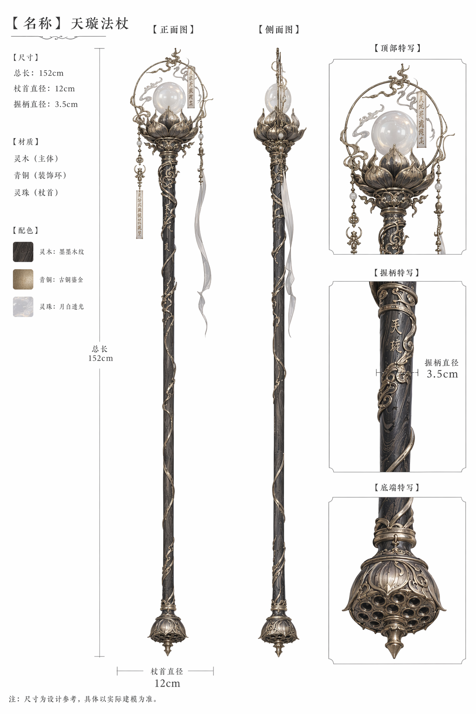

---

### 3.3 七星追魂针暗器套装

一整套暗器设计：飞针、收纳卷轴、袖箭发射器，适合拆分为装备模型与背包图标资产。

**Prompt:**
```
为仙侠游戏创建暗器套装正交参考图。
白色背景，展示一组精巧暗器的完整设计：
【套装名称】七星追魂针
【包含物品】
1. 飞针 ×7：细长银针，尾端有不同颜色的灵石标记，长15cm
2. 收纳卷轴：皮质卷筒，内有7个卡位，展开和收起两种状态
3. 袖箭发射器：手腕绑带式，金属+皮革，展示佩戴方式
标注信息（全中文）：
- 飞针长度：15cm，直径2mm
- 卷轴展开长度：35cm
- 袖箭发射器：腕围16-22cm可调
- 材质：玄铁（针）、灵蚕丝皮（卷轴）、精钢（发射器）
底部厘米比例尺。网格布局，干净正交投影。
风格：武器概念设计，适合3D建模参考。所有文字简体中文。
```

**参考图:** `outputs/02_male_protagonist_growth_arc/male_battle_portrait_20260503_075311.png`


**生成方式:** `edits` API + 参考图

**生成结果:**

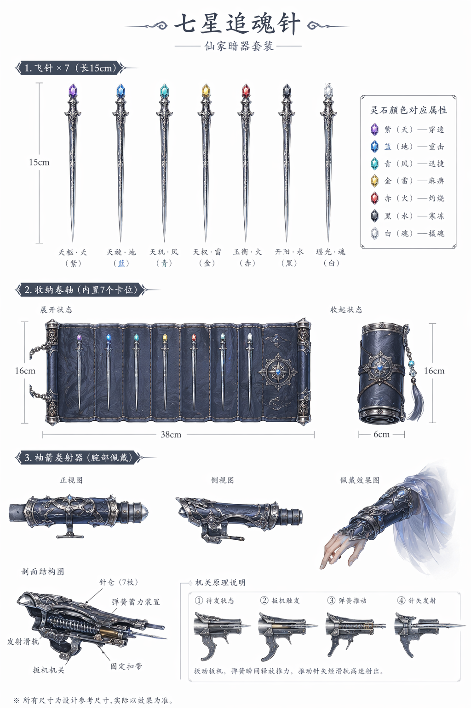

---

### 3.4 玄武镇岳盾法器护盾

展示休眠态和激活态两种形态，包含力场扩展示意，适合防御类法器建模。

**Prompt:**
```
为仙侠游戏创建法器护盾正交参考图。
白色背景，展示一面仙侠风格防御法器的设计：
【名称】玄武镇岳盾
【视图】
1. 正面视图：八角形盾面，中央玄武浮雕，边缘符文环绕
2. 背面视图：展示持握结构和灵力输入接口
3. 侧面视图：展示厚度和层次结构
4. 激活状态：灵力注入后符文发光，周围出现半透明力场延伸
标注信息（全中文）：
- 盾体直径：55cm（八角对角线）
- 盾体厚度：4.5cm（中心最厚）
- 力场扩展半径：75cm
- 材质：玄铁（主体）、灵玉（符文镶嵌）、妖兽皮（背带）
底部厘米比例尺。风格：正交概念设计。所有文字简体中文。
```

**参考图:** `outputs/05_yuanying_reunion_and_joint_breakthrough/joint_breakthrough_hero_20260503_081121.png`


**生成方式:** `edits` API + 参考图

**生成结果:**

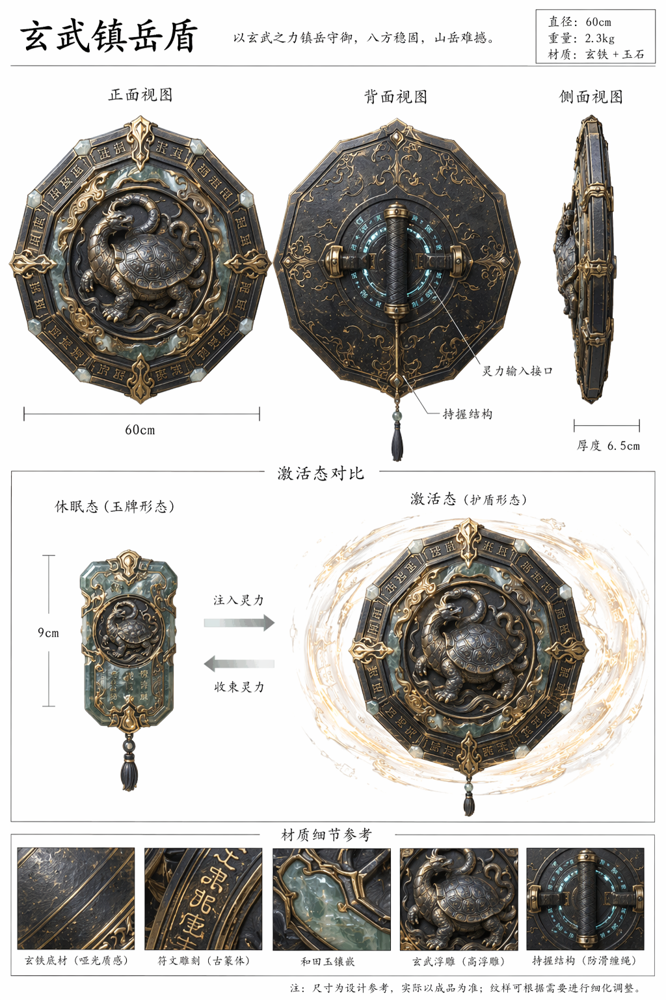

---

# 4. 表情与面部绑定参考

从基础表情范围到多角度表情板，支持面部绑定、Blendshape 制作和角色表演设计。

---

### 4.1 男主多角度表情板

选取 3 个核心表情，每个展示正面 / 3/4 侧 / 侧面三个角度，适合 3D 面部绑定制作。

**Prompt:**
```
基于这个男性仙侠角色，创建一张多角度表情参考板。
布局：3行 × 3列 网格。
列方向为角度变化：正面 | 3/4侧面 | 全侧面
行方向为表情变化：
第一行：平静坚毅（默认战斗表情）— 正面 | 3/4侧 | 侧面
第二行：暴怒（咬牙，眉头紧锁，鼻翼扩张）— 正面 | 3/4侧 | 侧面
第三行：释然微笑（战后放松，嘴角微扬）— 正面 | 3/4侧 | 侧面
要求：
- 同一发型、面部特征，仅表情和角度变化
- 头肩特写，干净中性灰背景
- 每格用中文标注：角度+表情名称
- 顶部标题：「男主表情参考板 - 多角度」
适合3D面部绑定制作。
```

**参考图:** `outputs/02_male_protagonist_growth_arc/male_battle_portrait_20260503_075311.png`


**生成方式:** `edits` API + 参考图 | **尺寸:** 1024×1536

**生成结果:**

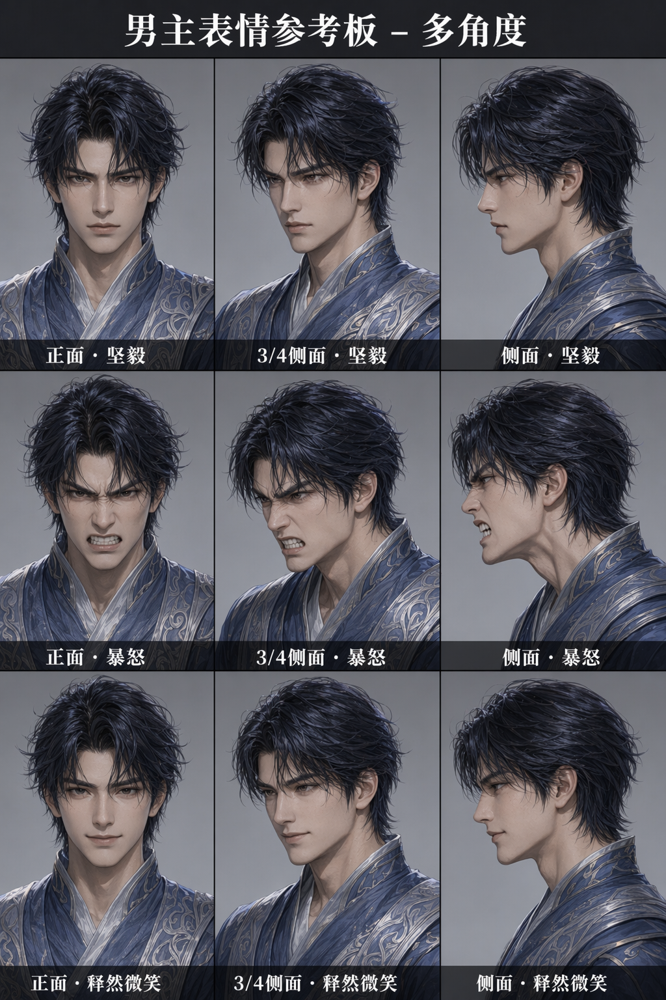

---

### 4.2 女主多角度表情板

3 种表情 × 3 个角度（正面 / 3/4 侧面 / 全侧面），适合面部绑定和 Blendshape 制作参考。

**Prompt:**
```
基于这个女性仙侠角色，创建一张多角度表情参考板。
布局：3行 × 3列 网格。
列方向为角度变化：正面 | 3/4侧面 | 全侧面
行方向为表情变化：
第一行：平静（默认状态）— 正面 | 3/4侧 | 侧面
第二行：温柔微笑 — 正面 | 3/4侧 | 侧面
第三行：释法专注（眼睛微眯，眉头微蹙，嘴唇轻抿）— 正面 | 3/4侧 | 侧面
要求：
- 同一发型、面部特征，仅表情和角度变化
- 头肩特写，干净中性背景
- 每格用中文标注：角度+表情名称
- 顶部标题：「女主表情参考板 - 多角度」
适合3D面部绑定和Blendshape制作参考。
```

**参考图:** `outputs/03_female_protagonist_growth_arc/female_battle_portrait_20260503_080212.png`


**生成方式:** `edits` API + 参考图 | **尺寸:** 1024×1536

**生成结果:**

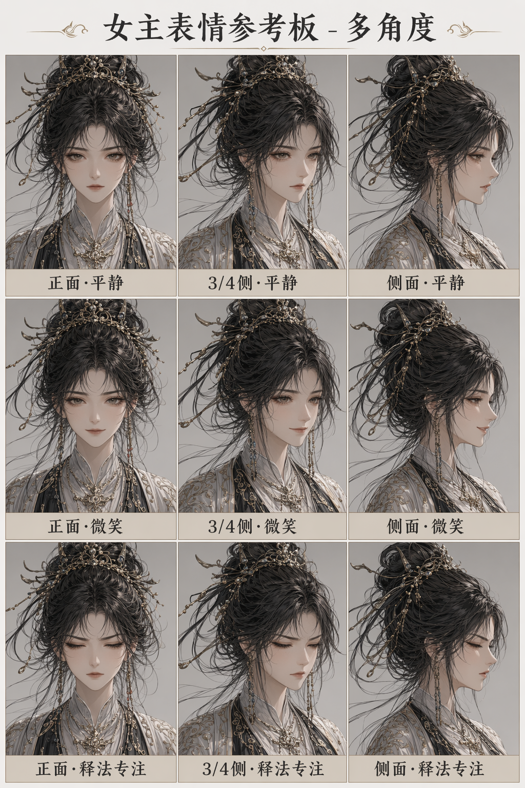

---

# 5. 动作与动画关键帧

这一组素材覆盖近战、远程剑气、双人合击、飞行、防御与治疗等动作参考，适合动画 blocking 和技能设计。

---

### 5.1 双人战斗动作关键帧 (Combat Action Keyframes)

为动画师提供战斗动作的关键 pose 参考。

**Prompt:**
```
基于这两个仙侠角色，创建战斗动画关键帧参考。
展示4个连续关键姿态：
1. 起手式 — 拔剑蓄势，重心居中
2. 突进斩 — 向前猛冲，展示动量方向
3. 凌空旋斩 — 半空旋转，衣袂飘飞
4. 落地收势 — 单膝着地，剑光扫尾
标注：动作线、重心分布、力的方向（中文）。
包含地面阴影作为空间参考。专业动画参考风格。
```

**生成方式:** `edits` API | **参考图:** `outputs/05_yuanying_reunion_and_joint_breakthrough/joint_breakthrough_hero_20260503_081121.png`


**生成结果:**

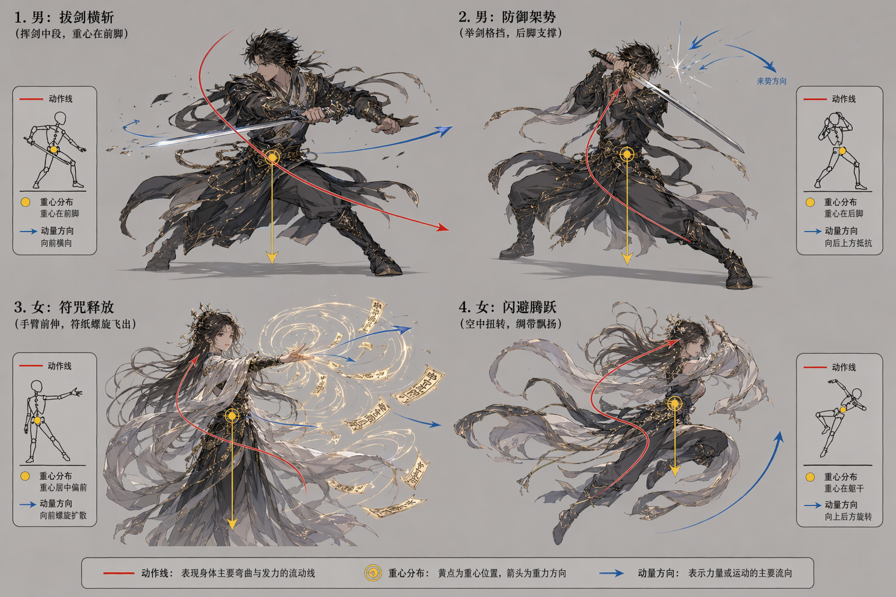

---

### 5.2 剑气远程攻击连招

展示从蓄力到剑气释放的完整连招序列，适合动画师做 blocking 参考。

**Prompt:**
```
为仙侠游戏创建一张战斗动画关键帧参考图——剑气远程攻击连招序列。
在中性灰色背景上，从左到右展示4个连续动作帧：
1. 蓄力：双手握剑于身侧，灵气汇聚于剑身（发光粒子效果）
2. 挥斩：大幅度横向斩击，剑身拖出弧形光带
3. 剑气释放：半月形剑气脱离剑身向前飞出，角色保持收势
4. 收剑归位：单手持剑垂于身侧，余韵飘散
每个帧旁标注：动作名称、重心位置（红点）、动量方向（箭头）、发力点。
底部包含时间轴标注（帧数）：第1帧、第12帧、第18帧、第30帧。
风格：清晰轮廓线+淡彩填充，适合动画师blocking参考。
所有文字标注使用简体中文。
```

**参考图:** `outputs/02_male_protagonist_growth_arc/male_battle_portrait_20260503_075311.png`


**生成方式:** `edits` API + 参考图

**生成结果:**

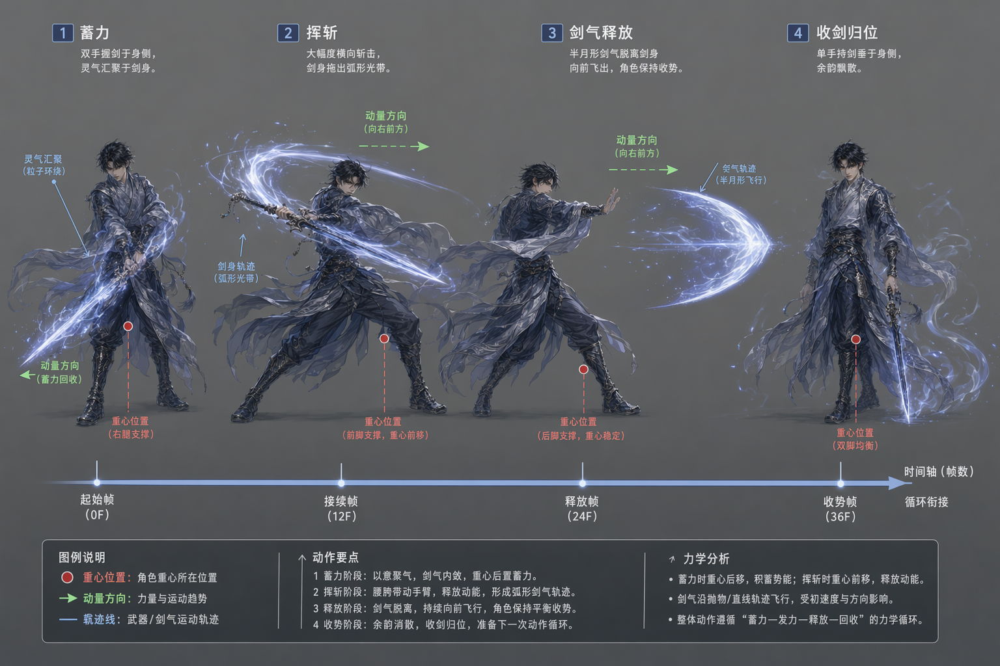

---

### 5.3 双人合击技「双星归一·天地同辉」

展示男女主角配合攻击的连续动作帧，包含双角色动作线标注。

**Prompt:**
```
基于这两个仙侠角色，创建双人合击技动画关键帧参考图。
在中性背景上展示4个配合动作帧（男女角色同框）：
1. 起手式：男女背靠背站立，各自蓄力（灵气从脚下螺旋上升）
2. 交错穿越：两人向对方方向冲刺交错，留下残影轨迹
3. 汇合爆发：在空中交汇点，双剑/法术能量融合形成巨大光球
4. 终结姿态：背对背落地，身后爆炸冲击波扩散
每帧标注：男角色动作线（蓝色）、女角色动作线（红色）、合力方向。
画面上方标注连招名称：「双星归一·天地同辉」。
风格：概念设计连续帧，带运动轨迹线和力学标注。
所有文字使用简体中文。
```

**参考图:** `outputs/05_yuanying_reunion_and_joint_breakthrough/joint_breakthrough_hero_20260503_081121.png`


**生成方式:** `edits` API + 参考图

**生成结果:**

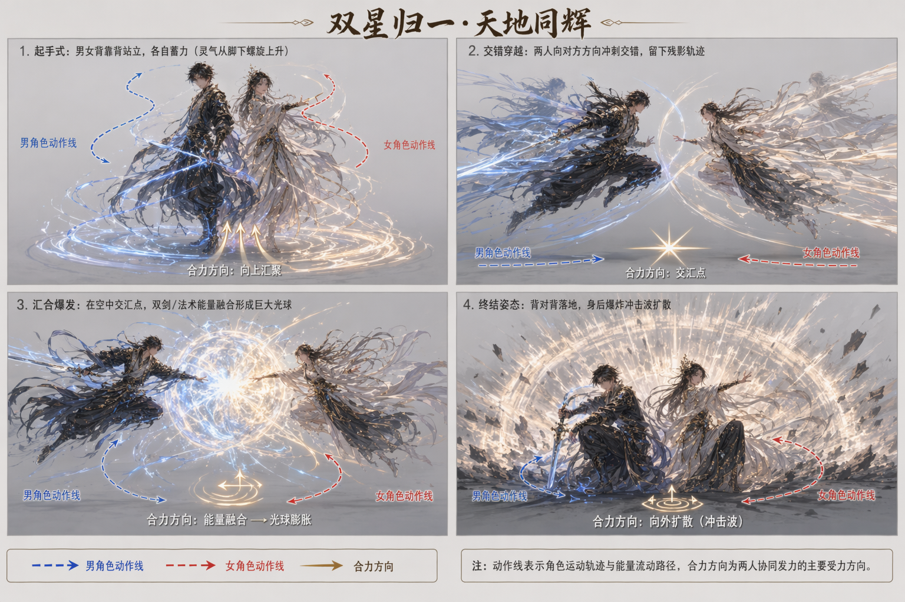

---

### 5.4 飞行战斗姿态（御剑飞行）

展示空中战斗动作，包含空气动力学标注和重心与飞剑的相对位置关系。

**Prompt:**
```
为仙侠游戏创建一张飞行战斗姿态参考图。
展示4个空中战斗动作（御剑飞行状态）：
1. 御剑巡航：站立于飞剑上，长袍飘逸，平衡姿态
2. 空中急停转向：身体前倾制动，飞剑翘起，绸带向前飘
3. 俯冲攻击：从高处向下俯冲，剑在前方，身体流线型
4. 空中翻转闪避：身体横向翻滚，飞剑跟随旋转
每个姿态标注：重心与飞剑的相对位置、气流方向（绿色箭头）、
平衡支撑点、衣物飘动方向。
侧面包含空气动力学简图。
风格：动态概念图，清晰轮廓，适合特效和动画参考。
所有标注简体中文。
```

**参考图:** `outputs/02_male_protagonist_growth_arc/male_battle_portrait_20260503_075311.png`


**生成方式:** `edits` API + 参考图

**生成结果:**

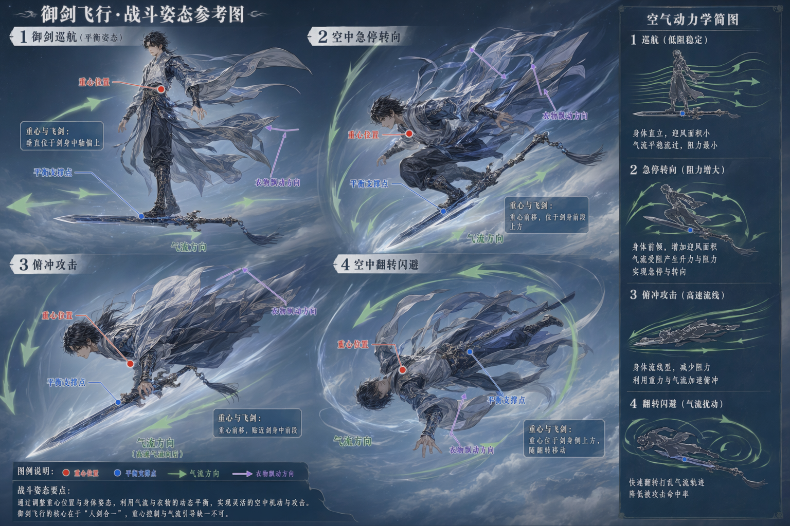

---

### 5.5 女主法术施放连招

女主战斗风格偏法术与辅助，与男主近战剑术形成差异化。

**Prompt:**
```
基于这个女性仙侠角色，创建一张法术施放动画关键帧参考图。
在中性灰色背景上，从左到右展示4个连续动作帧：
1. 结印蓄力：双手在胸前结印，指尖灵光闪烁，脚下法阵浮现
2. 符箓展开：右手向前推出，数道符纸从袖中飞出呈螺旋排列
3. 法术成形：双臂张开，符纸融合成巨大光阵，头发和衣物被灵压吹起
4. 释放收势：单手前指完成释放，另一手自然垂下，周围余波消散
每个帧旁标注：动作名称、重心位置（红点）、灵力流向（紫色箭头）、发力点。
底部包含时间轴标注（帧数）。
风格：清晰轮廓线+淡彩填充，适合动画师blocking参考。
所有文字标注使用简体中文。
```

**参考图:** `outputs/03_female_protagonist_growth_arc/female_battle_portrait_20260503_080212.png`


**生成方式:** `edits` API + 参考图

**生成结果:**

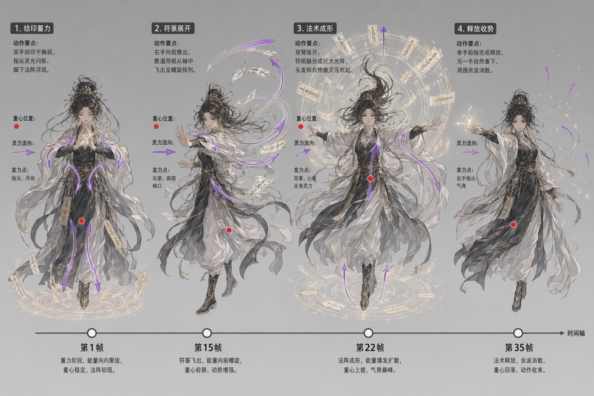

---

### 5.6 女主符箓飞行姿态

女主以符箓飞行，重点展示裙装、发丝和飘带在空中动作中的动态表现。

**Prompt:**
```
基于这个女性仙侠角色，创建一张飞行姿态参考图。
展示4个空中姿态（踏符飞行状态，脚下踩着发光符箓而非飞剑）：
1. 优雅巡航：单脚点于符箓上，另一脚微曲，长裙飘逸如云
2. 急速前冲：身体前倾45度，双手后摆，裙摆和发丝向后飘
3. 悬停施法：盘坐于大型法阵上，周围环绕旋转的符纸
4. 优雅降落：从空中缓缓落下，裙摆展开如伞，轻盈着地
每个姿态标注：重心与符箓的相对位置、气流方向、衣物飘动方向。
注意展示女性角色飞行时裙装和飘带的动态表现。
风格：动态概念图，清晰轮廓。所有标注简体中文。
```

**参考图:** `outputs/03_female_protagonist_growth_arc/female_battle_portrait_20260503_080212.png`


**生成方式:** `edits` API + 参考图

**生成结果:**

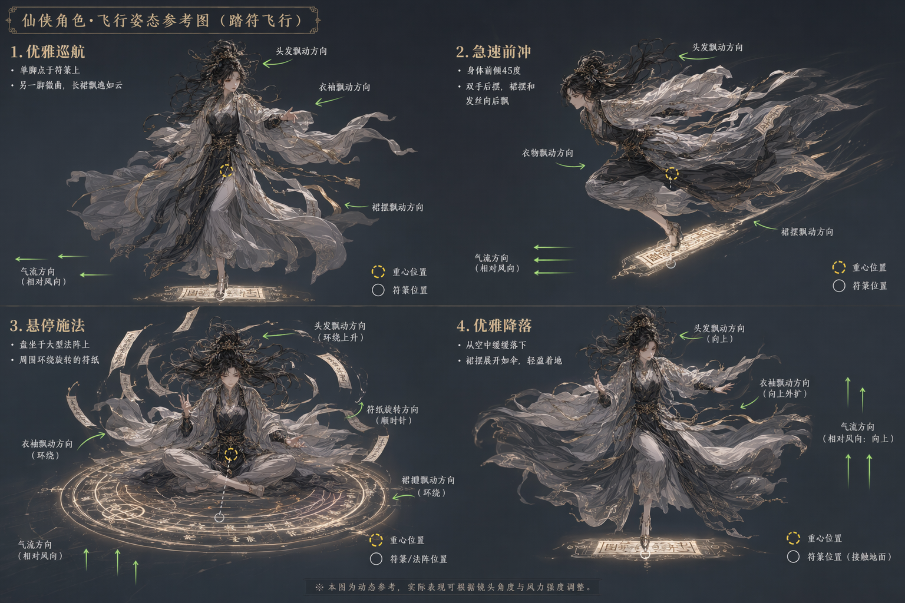

---

### 5.7 女主防御与治疗姿态

展示女主作为辅助角色的防御和治疗动作，覆盖护盾、治疗结界、反弹防御和复活仪式等关键姿态。

**Prompt:**
```
基于这个女性仙侠角色，创建一张防御与治疗动画关键帧参考图。
在中性背景上展示4个动作帧：
1. 护盾展开：双手前推，面前展开半透明符文护盾，身体微后仰
2. 治疗结界：单膝跪地，双手按于地面，脚下绿色治愈法阵扩散
3. 反弹防御：侧身格挡姿态，护盾将攻击弹回，身体扭转借力
4. 复活仪式：双手高举过头，全身发出柔和金光，周围花瓣飘散
每帧标注：动作名称、重心位置、灵力输出方向、防御/治疗范围（虚线圈）。
底部标注技能冷却时间参考和灵力消耗等级。
风格：概念设计帧，带力学标注。所有文字简体中文。
```

**参考图:** `outputs/03_female_protagonist_growth_arc/female_battle_portrait_20260503_080212.png`


**生成方式:** `edits` API + 参考图

**生成结果:**

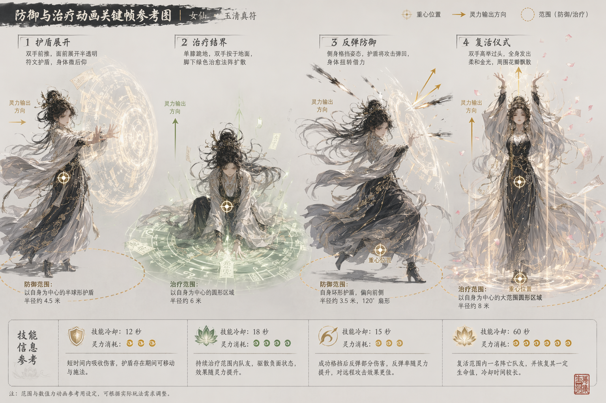

---

### 5.8 绿幕素材与工业化抠图流水线


>
> 这一节我们演示的是：
>
> 1. 直接让 GPT-Image-2 生成 `#00FF00` **纯绿幕背景**的角色 / 道具图；
> 2. 用两种方式抠出透明背景：**rembg（AI 抠图）** 和 **Chroma Key（色度键）**；
> 3. 给大家一份**绿幕生成的 prompt 写法清单**，回去就能直接套。
>

---

本 notebook 演示如何使用 GPT-image-2 生成**绿幕背景素材**，然后通过自动化工具提取前景为透明 PNG，
模拟游戏/影视工业中的素材资产生产流程。


#### 5.8.1 流程概览

```
参考图 → GPT-image-2 (edits, 绿幕prompt) → 绿幕原图 → 提取
                                                          ├── rembg (AI 抠图)  → PNG (透明背景)
                                                          └── Chroma Key (色度键) → PNG (透明背景)
```

**两种提取方法对比：**
- **rembg**: 基于 U2-Net 的 AI 抠图，对复杂边缘（头发、飘带）效果好
- **Chroma Key**: 传统绿色通道阈值抠像，速度快但边缘可能有绿色残留

---

#### 5.8.2 男主 — 站立待机姿态

**用途:** 角色选择界面、UI立绘、宣传物料

**Prompt 要点:**
- 明确指定 `纯绿色背景（#00FF00）`
- 强调 `不能有阴影、渐变或环境元素`
- 要求 `轮廓清晰锐利，没有绿色溢色`
- 指定 `全身可见，包含脚部`

##### 绿幕原图

**参考图:** `outputs/02_male_protagonist_growth_arc/male_battle_portrait_20260503_075311.png`


**Prompt:**
```
基于这个男性仙侠角色，在纯绿色背景（#00FF00 纯绿幕）上生成角色的全身站立姿态。
角色面向镜头，自然站姿，一手握剑，气质沉稳。
背景必须是完全均匀的纯绿色（用于后期抠像），不能有任何阴影、渐变或环境元素。
角色轮廓清晰锐利，没有绿色溢色。全身可见，包含脚部。
```

**生成方式:** `edits` API + 参考图 | **质量:** high

**绿幕原图:**

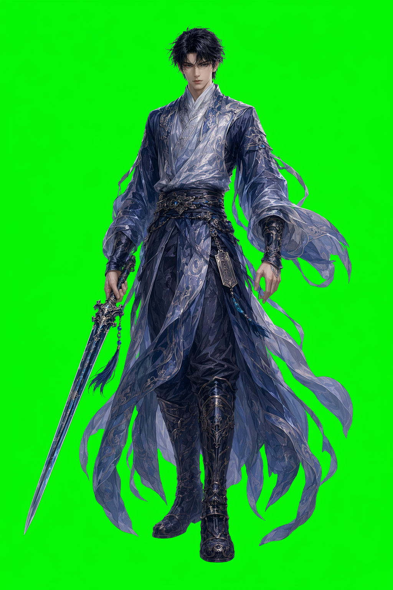

**提取结果:**

| rembg (AI 抠图) | Chroma Key (色度键) |
|---|---|
| 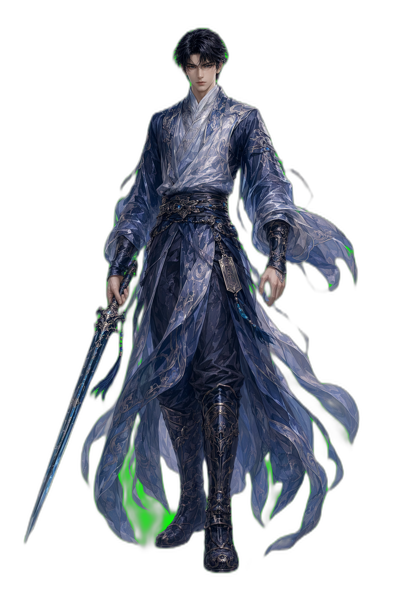 | 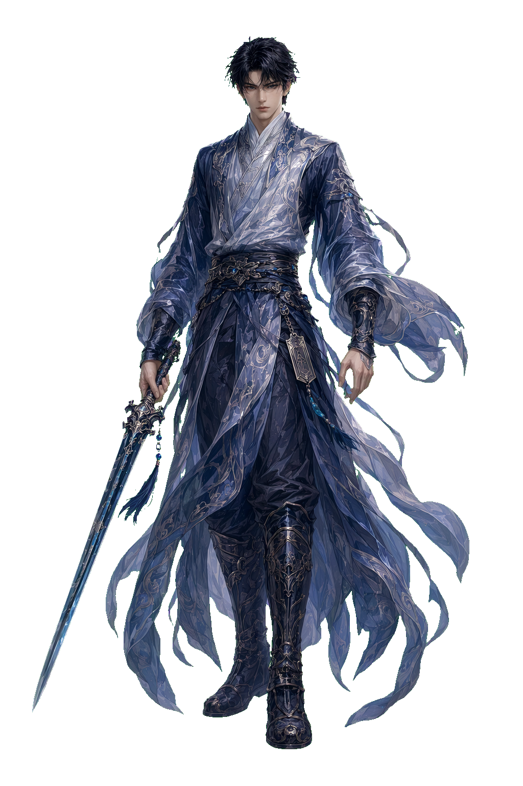 |

---

#### 5.8.3 女主 — 施法姿态

**用途:** 技能图标、战斗UI、角色卡面

##### 绿幕原图

**参考图:** `outputs/03_female_protagonist_growth_arc/female_battle_portrait_20260503_080212.png`


**Prompt:**
```
基于这个女性仙侠角色，在纯绿色背景（#00FF00 纯绿幕）上生成角色的全身施法姿态。
角色双手前推，指尖灵光闪烁，裙摆随灵力飘动。
背景必须是完全均匀的纯绿色（用于后期抠像），不能有任何阴影或环境元素。
角色轮廓清晰锐利，没有绿色溢色。全身可见。
```

**生成方式:** `edits` API + 参考图 | **质量:** high

**绿幕原图:**

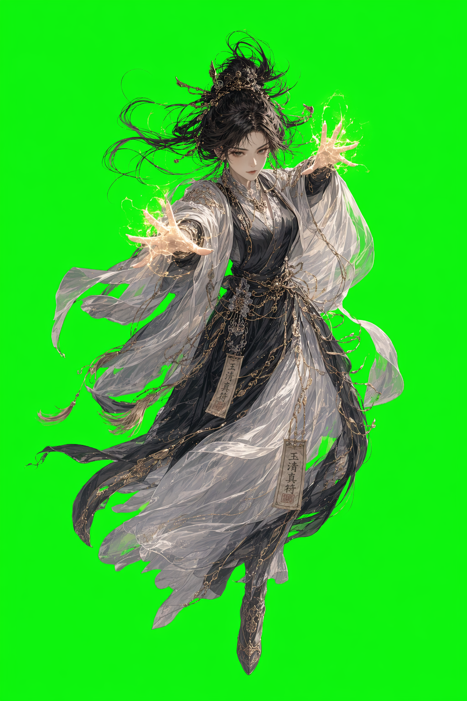

**提取结果:**

| rembg (AI 抠图) | Chroma Key (色度键) |
|---|---|
| 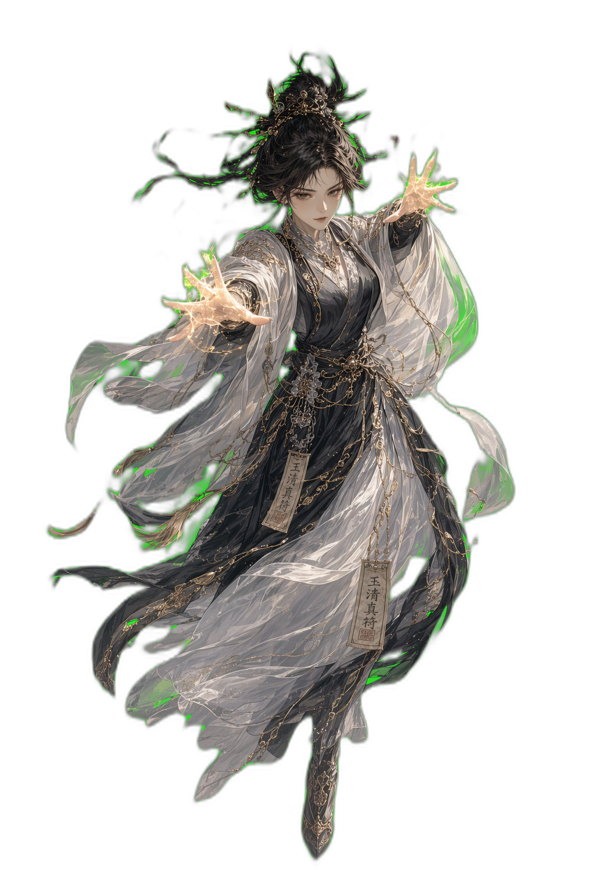 | 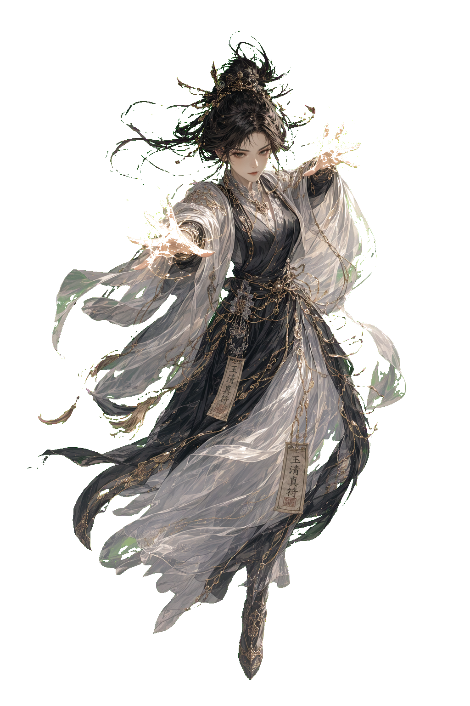 |

---

#### 5.8.4 武器道具 — 仙侠长剑

**用途:** 道具图标、装备界面、商城展示

##### 绿幕原图

**参考图:** `outputs/02_male_protagonist_growth_arc/male_battle_portrait_20260503_075311.png`


**Prompt:**
```
基于这个仙侠角色的佩剑风格，在纯绿色背景（#00FF00 纯绿幕）上生成一把仙侠长剑的道具图。
剑身修长，剑格为蓝色玉石镶嵌，剑柄缠绕金丝，剑鞘深青色带符文。
展示：出鞘状态的完整剑身，45度角放置。
背景必须是完全均匀的纯绿色。物品轮廓锐利清晰。
```

**生成方式:** `edits` API + 参考图 | **质量:** high

**绿幕原图:**

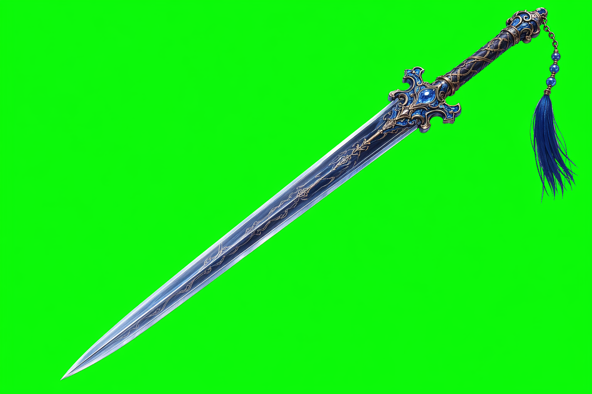

**提取结果:**

| rembg (AI 抠图) | Chroma Key (色度键) |
|---|---|
| 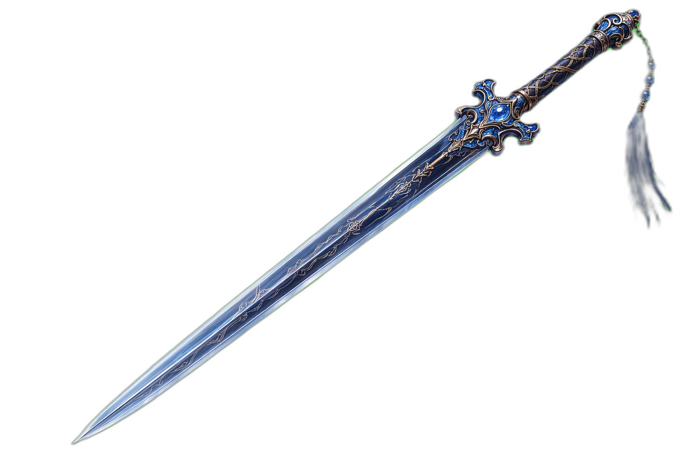 | 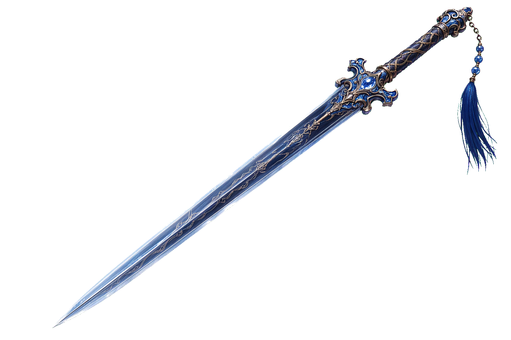 |

---

#### 5.8.5 方法对比总结

| 维度 | rembg (AI) | Chroma Key |
|------|-----------|------------|
| 速度 | ~3秒/张 | <0.5秒/张 |
| 头发/飘带边缘 | ⭐⭐⭐⭐⭐ 优秀 | ⭐⭐⭐ 可能残留 |
| 光效保留 | ⭐⭐⭐⭐ 好 | ⭐⭐ 可能误删 |
| 绿色溢色处理 | ⭐⭐⭐⭐ 自动 | ⭐⭐ 需后处理 |
| 适用场景 | 复杂边缘、最终品质 | 批量处理、快速预览 |
| 依赖 | U2-Net 模型 (176MB) | 无 (纯NumPy) |

##### 工业化建议

1. **快速预览/批量检查:** 用 Chroma Key（毫秒级）
2. **最终交付:** 用 rembg 或更高级的 Matting 算法
3. **特效素材:** 考虑黑底 + Screen Blend，或白底 + Multiply，而非绿幕
4. **角色素材:** 绿幕方案最适合，配合 rembg 效果最佳

##### Prompt 绿幕生成技巧

```
✅ 有效的绿幕 prompt 关键词：
- "纯绿色背景（#00FF00 纯绿幕）"
- "背景必须完全均匀"
- "不能有阴影、渐变或环境元素"
- "轮廓清晰锐利，没有绿色溢色"
- "全身可见，包含脚部"

❌ 避免的描述：
- "绿色调的..."（会让模型把绿色混入角色）
- "自然光照"（会产生投影）
- "站在地面上"（会生成地面/阴影）
```

---

#### 5.8.6 素材输出一览

| 素材 | 绿幕原图 | AI提取 | 色度键提取 |
|------|----------|--------|-----------|
| 男主站立 | `male_standing_pose_greenscreen.png` | `male_standing_pose_extracted.png` | `male_standing_pose_chromakey.png` |
| 女主施法 | `female_casting_pose_greenscreen.png` | `female_casting_pose_extracted.png` | `female_casting_pose_chromakey.png` |
| 男主挥剑 | `male_sword_attack_greenscreen.png` | `male_sword_attack_extracted.png` | `male_sword_attack_chromakey.png` |
| 武器道具 | `weapon_sword_prop_greenscreen.png` | `weapon_sword_prop_extracted.png` | `weapon_sword_prop_chromakey.png` |
| 法术特效 | `spell_effect_orb_greenscreen.png` | `spell_effect_orb_extracted.png` | `spell_effect_orb_chromakey.png` |

共 15 个文件，每个素材 3 种版本（绿幕原图 / AI提取 / 色度键提取）。

---

# 6. 场景与游戏界面

最后补充场景概念、关卡空间和完整战斗 UI 截图，让 3D 资产可以落到真实游戏体验中。

---

### 6.1 宗门道场场景概念 (Environment Concept)

为关卡场景提供多角度概念图，帮助场景建模师理解空间尺度和氛围。

**Prompt:**
```
创建仙侠游戏场景概念图——青云宗道场主殿与练功场。
多视角展示：
1. 鸟瞰俯视图 — 展示建筑群布局和动线
2. 英雄镜头 — 平视主殿大门，展示气势和比例
3. 细节特写（3小图）：灵灯、青石台阶纹路、结界光幕
包含比例参考人物。云雾缭绕，体积光穿过云层。
所有标注使用中文。右下角附设计说明文字框。
专业游戏场景概念风格。
```

**生成方式:** `generations` API

**生成结果:**

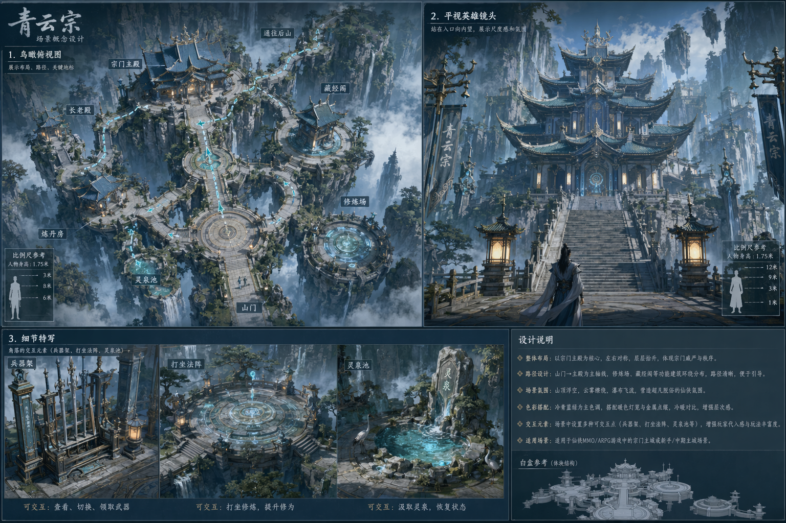

---

### 6.2 男主 BOSS 战游戏界面

生成完整的 3D 仙侠 ARPG 战斗截图，包含标准游戏 UI 元素。

**参考图:** `outputs/02_male_protagonist_growth_arc/male_battle_portrait_20260503_075311.png`


**Prompt:**
```
基于这个男性仙侠角色，生成一张完整的3D仙侠ARPG游戏战斗截图。

场景：角色正在深山古洞中对战一只巨型石魔（BOSS）。

【必须包含的游戏UI元素】：
- 左上角：角色头像 + HP血条（绿色，约75%） + MP蓝条（蓝色，约40%）+ 角色等级"Lv.67"
- 右上角：BOSS血条（红色，约50%）+ BOSS名称"石魔·磐岩之主" + BOSS等级标记
- 左下角：技能快捷栏（4个技能图标，带冷却遮罩，其中一个正在冷却中）
  - 技能1：「剑气斩」
  - 技能2：「御剑术」
  - 技能3：「天罡剑阵」（冷却中，半透明遮罩+倒计时3s）
  - 技能4：「剑意领域」（大招，金色边框）
- 右下角：小地图（圆形，显示BOSS红点和角色绿点）
- 中上方：连击数 "COMBO x23" （金色字体，带光效）
- 屏幕中央偏右：伤害数字飘浮 "-12,450" "暴击!" （红色大字）

【战斗场景】：
- 角色正挥剑释放蓝色剑气横斩
- 石魔（巨大岩石怪物）正举起石拳准备砸下
- 地面有技能法阵光效
- 环境：幽暗洞穴，有水晶矿石发光

风格：高品质3D手游截图，类似《天涯明月刀》《逆水寒》的画质。
所有UI文字使用简体中文。分辨率16:9横屏。
```

**生成方式:** `edits` API + 参考图 | **尺寸:** 1536×1024 | **质量:** high

**生成结果:**

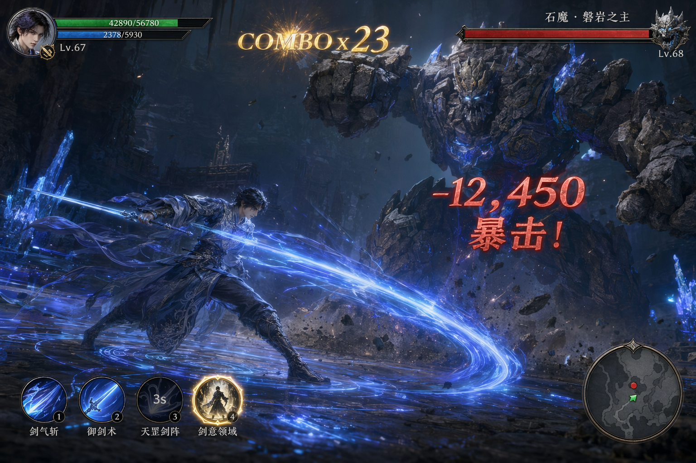

---

### 6.3 女主 AOE 群战游戏界面

生成完整的 3D 仙侠 ARPG 群战截图，展示法术角色的战斗 UI、任务追踪和大范围技能表现。

**参考图:** `outputs/03_female_protagonist_growth_arc/female_battle_portrait_20260503_080212.png`


**Prompt:**
```
基于这个女性仙侠角色，生成一张完整的3D仙侠ARPG游戏战斗截图。

场景：角色正在樱花林中对战一群妖狐精怪（小怪群战）。

【必须包含的游戏UI元素】：
- 左上角：角色头像 + HP血条（绿色，约90%） + MP蓝条（蓝色，约25%）+ 角色等级"Lv.65"
- 屏幕中上：当前怪物信息条 "妖狐·九尾幻影 Lv.63" + 血条（约30%）
- 左下角：技能快捷栏（4个技能图标）
  - 技能1：「符箓封印」
  - 技能2：「灵泉治愈」（正在释放，发光状态）
  - 技能3：「天女散花」
  - 技能4：「凤凰涅槃」（大招，紫金色边框，已就绪）
- 右下角：小地图（圆形，显示多个红点代表小怪群）
- 右侧中部：任务追踪面板 "当前任务：净化妖狐谷 (17/20)"
- 屏幕中央：大范围AOE法术效果——角色释放的紫色符箓阵铺满地面
- 飘浮伤害数字：多个 "-3,240" "-2,890" 散布在被命中的妖狐上方

【战斗场景】：
- 角色悬浮在空中，双手展开，脚下巨大法阵
- 地面上4-5只妖狐精怪被符箓困住
- 樱花飘落，粉色花瓣与紫色法术光效交织
- 环境：梦幻樱花林，远处有古塔

风格：高品质3D手游截图，类似《天涯明月刀》《逆水寒》的画质。
所有UI文字使用简体中文。分辨率16:9横屏。
```

**生成方式:** `edits` API + 参考图 | **尺寸:** 1536×1024 | **质量:** high

**生成结果:**

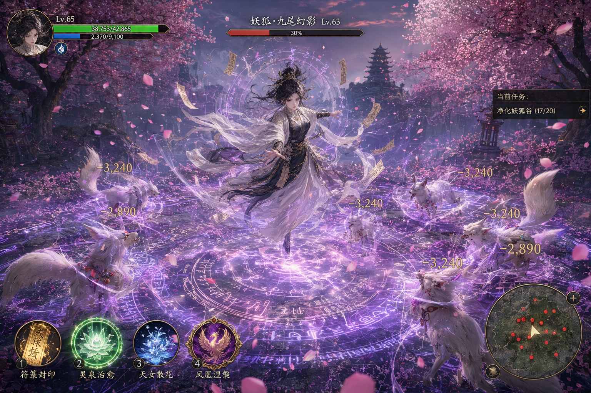

**说明:** GPT-image-2 能够理解并渲染复杂的游戏 UI 布局，包括血条、技能图标、伤害数字等标准游戏界面元素。中文文字渲染在 UI 元素中表现良好。

---

# 交付总结

| 阶段 | 素材数量 | 覆盖内容 |
|------|----------|----------|
| 角色基础与三视图 | 2 | 男主三视图、女主三视图 |
| 材质、服装与光照 | 5 | 材质参考板、男女服装拆解、男女光照参考 |
| 武器与道具 | 4 | 武器道具正交图、法杖、暗器套装、护盾 |
| 表情与面部绑定 | 3 | 基础表情板、女主多角度表情、男主多角度表情 |
| 动作与动画关键帧 | 7 | 战斗动作、剑气、合击、飞行、女主法术/飞行/防御治疗 |
| 场景与游戏界面 | 3 | 宗门道场、男主 BOSS 战 UI、女主 AOE 群战 UI |

**共计 24 组 demo 素材**，覆盖从角色设定、材质拆解、道具建模、表情绑定、动作动画到场景与 UI 的完整 3D 预生产链路。

### 使用建议

- 向建模团队展示时，从三视图、服装拆解、武器正交图开始
- 向动画团队展示时，重点看表情板和动作关键帧
- 向游戏制作或客户演示时，可以用场景概念和 3D 游戏 UI 截图收尾
- 后续扩展素材时，建议继续按本 notebook 的主题分组追加


## 总结

具体到我们今天演示的这套修仙双线故事，可以把价值拆成三层：

1. **概念层 / 立项阶段**：角色设定、世界观、关键剧情分镜，可以一天之内出几十个方向，加速立项评审。
2. **预生产层 / 3D 制作前**：三视图、服装拆解、光照参考、武器正交、表情板、动作关键帧——这一套以前需要多个原画师协作数周的资产，现在可以快速出demo，加速迭代。
3. **运营层 / 上线之后**：横版 KV、竖版海报、剪影叙事海报、绿幕立绘——版本宣传、活动页、商城 icon，都可以**按周迭代**而不是按月。

今天这些图是我这样一个**没有美术基础的小白**，靠着 prompt 一步一步摸出来的。在各位专业美术老师看来，它们可能仍然只是一些**玩具级 demo**：构图、风格、细节和工业可用性，都还谈不上最终交付。

但这也恰恰说明了这类工具真正有想象力的地方：如果操控 GPT-Image-2 的人不是我，而是各位有审美、有经验、知道问题在哪里、也知道该怎么改的专业美术老师，结果一定会完全不一样。

所以限制依然存在：

- **风格上限**仍然取决于操作者自己的审美、经验和 prompt 表达能力；
- **角色超长一致性**还做不到电影级，需要靠"分阶段 edit + 多次抽卡 + 人工挑图"；
- **复杂构图**还需要靠多参考图 + 反复修正才能稳定收敛。

如果各位今天只带一句话回去，我希望是这句：

> **GPT-Image-2 希望能成为各位美术老师的"电子实习生"。**
> 它最大的价值，是把过去花在"做第一稿"上的时间，省下来花在"做最终稿"上。

非常感谢各位老师的时间，谢谢！

---
